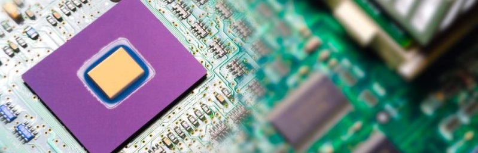

Cache a function:
================

## Introduction

Sometimes in programming is usefull to **store a result of a function**
for later use instead of recalculating, Cache functions are function
that are able to **cache potentially time-consuming computations**. For
example, taking the mean of a numeric vector is typically a fast
operation. However, for a very long vector, it may take too long to
compute the mean, especially if it has to be computed repeatedly
(e.g. in a loop). If the contents of a vector are not changing, it may
make sense to cache the value of the mean so that when we need it again,
it can be looked up in the cache rather than recomputed.

## matrix\_inverse\_cache.R

In this subfolder repository a **cache function that calculates the
inverse of a matrix** can be found. **Matrix inversion is usually a
costly computation** and there may be some benefit to caching the
inverse of a matrix rather than computing it repeatedly. The function
first checks to see if the inverse has already been calculated. If so,
it gets the inverse from the cache and skips the computation. Otherwise,
it calculates the inverse of the matrix and sets the value in the cache.
