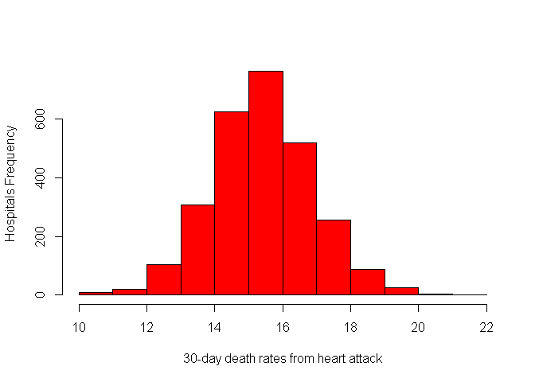

Hospital Quality Comparison
================

## Introduction

This data come from the **Hospital Compare web site** ( visit
[here](http://hospitalcompare.hhs.gov) ) run by the **U.S. Department of
Health and Human Services**. The purpose of the web site is to provide
data and information about the **quality of care** at over **4,000
Medicare-certified hospitals in the U.S.** This dataset essentially
covers all major U.S. hospitals. This dataset is used for a variety of
purposes, including **determining whether hospitals should be fined for
not providing high quality care to patients** (enter
[here](http://goo.gl/jAXFX) for some background on this particular
topic).


## Data set

The Hospital Compare web site contains a lot of data and we will only
look at a small subset for this project. The link data files contains
three files:

  - **outcome-of-care-measures.csv:** Contains information about 30-day
    mortality and readmission rates for heart attacks, heart failure,
    and pneumonia for over 4,000 hospitals.

  - **hospital-data.csv:** Contains information about each hospital.

  - **Hospital\_Revised\_Flatfiles.pdf:** Descriptions of the variables
    in each file (i.e the code book)

Download here:
[HospitalCompare\_Data](https://d396qusza40orc.cloudfront.net/rprog%2Fdata%2FProgAssignment3-data.zip)

### Data subset:

A **description of the variables** in each of the files is in the
included PDF file named **Hospital\_Revised\_Flatfiles.pdf.** This
document contains information about many other files that are not
included in this dataset. This data-subset is focus on the variables for
Number 19 (“Outcome of Care Measures.csv”) and Number 11 (“Hospital
Data.csv”).

## Hospital Comparison Analysis:

### U.S Hospitals 30-day mortality rates for heart attack

<!-- -->

[see the plot code here](XXXXX)

### Finding the best hospital in a state (best\_hospital.R)

The function reads the outcome-of-care-measures.csv file and **returns a
character vector with the name of the hospital that has the best
(i.e. lowest) 30-day mortality for the specified outcome in that
state.** The hospital name is the name provided in the Hospital.Name
variable. The outcomes can be one of “heart attack”, “heart failure”, or
“pneumonia”. Hospitals that do not have data on a particular outcome
should be excluded from the set of hospitals when deciding the rankings.

The function check the validity of its arguments. If an invalid state
value is passed to best, the function should throw an error via the stop
function with the exact message “invalid state”. If an invalid outcome
value is passed to best, the function should throw an error via the stop
function with the exact message “invalid outcome”.

[see the function code here](XXXXX)

Here is some sample output from the function:

``` r
source("coding/best_hospital.R")
best("TX", "heart attack")
```

    ## [1] "CYPRESS FAIRBANKS MEDICAL CENTER"

``` r
best("TX", "heart failure")
```

    ## [1] "FORT DUNCAN MEDICAL CENTER"

``` r
best("BB", "heart attack")
```

    ## Error in best("BB", "heart attack"):  invalid state

``` r
best("NY", "hert attack")
```

    ## Error in best("NY", "hert attack"):  invalid outcome

### Ranking hospitals by outcome in a state (rank\_hospital.R)

This function called rankhospital takes three arguments: the 2-character
abbreviated name of a state (state), an outcome (outcome), and the
ranking of a hospital in that state for that outcome (num). **The
function** reads the outcome-of-care-measures.csv file and **returns a
character vector with the name of the hospital that has the ranking
specified by the num argument.**

The function check the validity of its arguments. If an invalid state
value is passed to rankhospital, the function will send an error via the
stop function with the exact message “invalid state”. If an invalid
outcome value is passed to rankhospital, the function will send an error
via the stop function with the exact message “invalid outcome”.

[see the function code here](XXXXX)

``` r
source("coding/rank_hospital.R")
rankhospital("TX", "heart failure", 4)
```

    ## [1] "DETAR HOSPITAL NAVARRO"

``` r
rankhospital("MD", "heart attack", "worst")
```

    ## [1] "HARFORD MEMORIAL HOSPITAL"

### Ranking all the hospitals (rank\_all.R)

The function called rankall takes two arguments: an outcome name
(outcome) and a hospital ranking (num). **The function** reads the
outcome-of-care-measures.csv file and **returns a 2-column data frame
containing the hospital in each state that has the ranking specified in
num.** For example the function call rankall(“heart attack”, “best”)
would return a data frame containing the names of the hospitals that are
the best in their respective states for 30-day heart attack death rates.
The function will return a value for every state (some may be NA). The
first column in the data frame is named hospital, which contains the
hospital name, and the second column is named state, which contains the
2-character abbreviation for the state name. Hospitals that do not have
data on a particular outcome will be excluded from the set of hospitals
when deciding the rankings.

[see the function code here](XXXXX)

``` r
source("coding/rank_all.R")
head(rankall("heart attack", 20), 10)
```

    ##                               hospital state
    ## 2                                 <NA>    AK
    ## 3       D W MCMILLAN MEMORIAL HOSPITAL    AL
    ## 4    ARKANSAS METHODIST MEDICAL CENTER    AR
    ## 5  JOHN C LINCOLN DEER VALLEY HOSPITAL    AZ
    ## 6                SHERMAN OAKS HOSPITAL    CA
    ## 7             SKY RIDGE MEDICAL CENTER    CO
    ## 8              MIDSTATE MEDICAL CENTER    CT
    ## 9                                 <NA>    DC
    ## 10                                <NA>    DE
    ## 11      SOUTH FLORIDA BAPTIST HOSPITAL    FL

``` r
tail(rankall("pneumonia", "worst"), 3)
```

    ##                                      hospital state
    ## 53 MAYO CLINIC HEALTH SYSTEM - NORTHLAND, INC    WI
    ## 54                     PLATEAU MEDICAL CENTER    WV
    ## 55           NORTH BIG HORN HOSPITAL DISTRICT    WY
