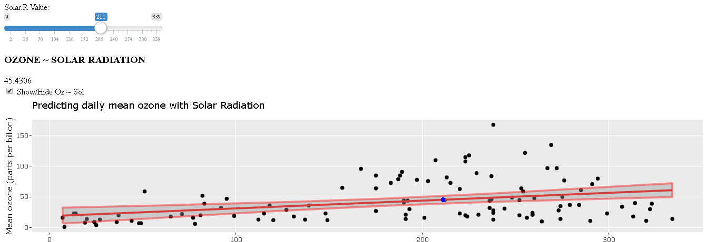

Air Quality data set - Ozone and Temperature predictor app
================

## Introducction

**Daily air quality measurements** were recorded at **New York**, from
**May to September 1973**. The data were obtained from the New York
State Department of Conservation (ozone data) and the National Weather
Service (meteorological data).

## Ozone and UV Radiation Cicle:

The photochemical mechanisms that give rise to the **ozone layer** were
discovered by the British physicist Sydney Chapman in 1930. **Ozone in
the Earth’s stratosphere is created by ultraviolet light striking
ordinary oxygen molecules** containing two oxygen atoms (O2), splitting
them into individual oxygen atoms (atomic oxygen); the atomic oxygen
then combines with unbroken O2 to create ozone, O3. The ozone molecule
is unstable (although, in the stratosphere, long-lived) and when
ultraviolet light hits ozone it splits into a molecule of O2 and an
individual atom of oxygen, a continuing process called the ozone-oxygen
cycle.

### Data:

Download the data set
[here](https://forge.scilab.org/index.php/p/rdataset/source/tree/master/csv/datasets/airquality.csv)

The data frame contains 153 observations on 6 variables.

1.  **Ozone numeric Ozone (ppb)**
2.  **Solar.R numeric Solar R (lang)**
3.  **Wind numeric Wind (mph)**
4.  **Temp numeric Temperature (degrees F)**
5.  **Month numeric Month (1–12)**
6.  **Day numeric Day of month (1–31)**

The overall goal of this project is to create an **interactive app**
that **predicts the outcome of the temperature and Ozone levels based on
the value of the Solar Radiation** with the help of the **New York
airquality data set.**

### OT predictor app:

Here you can try out the app: [OTP
app](https://cdopazo.shinyapps.io/FinalApp/)

### How to use it:

The web app has a **slider to input the solar radiation** data, based on
this input two charts are ploted to predict the output value for **Ozone
mean and Maximum daily temperature**. Below the chart titles are two
**check boxes to show or hide the plots.**

The plotted charts are **two lineal regresion models** with the **mean
and the error plotted in red** and the **raw data plotted in black
dots.**

The **Ozone and Temperature output** are plotted in a **blue dot on the
regression charts**, but also **showed as a number** below the chart
titles and above the check boxes.

#### OTP Screenshot:

[See the server app code here](https://github.com/CDopazo/Project_portfolio/blob/master/R/Data%20web%20products/Airquality_OTP_app/coding/server.R)

[See the UI app code here](https://github.com/CDopazo/Project_portfolio/blob/master/R/Data%20web%20products/Airquality_OTP_app/coding/ui.R)

#### References:

Chambers, J. M., Cleveland, W. S., Kleiner, B. and Tukey, P. A. (1983)
Graphical Methods for Data Analysis. Belmont, CA: Wadsworth.
