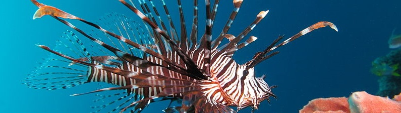
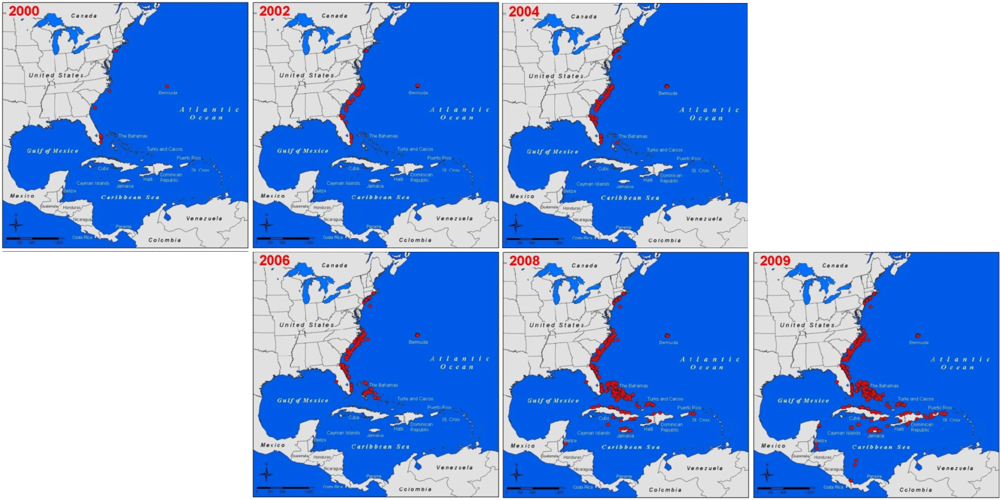
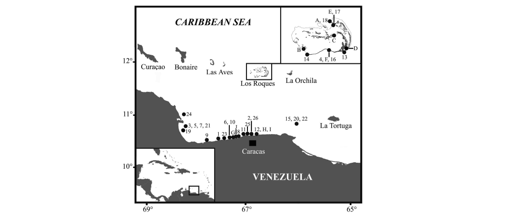
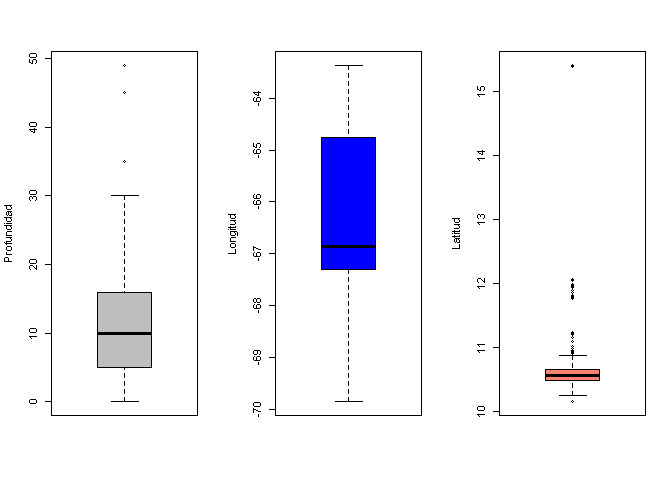
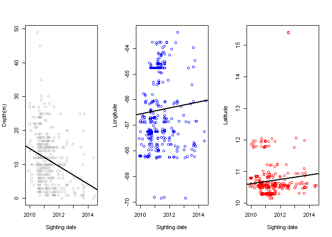
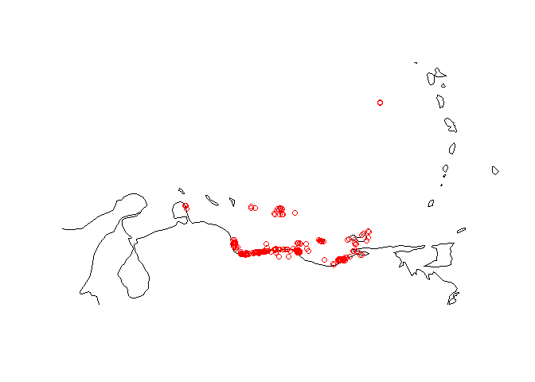
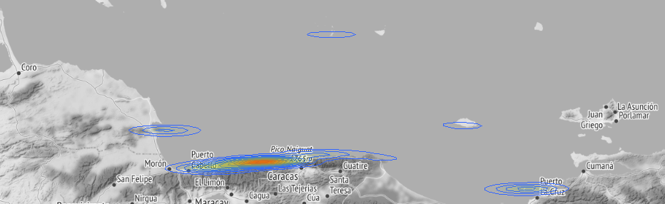

Lionfish on the Caribbean Sea analysis:
================

## Introduction

*Pterois* is a genus of venomous marine fish, commonly known as
**lionfish**, native to the **Indo-Pacifi**c. Also called zebrafish,
firefish, turkeyfish, tastyfish or butterfly-cod, it is characterized by
conspicuous warning coloration with red, white, creamy, or black bands,
showy pectoral fins, and venomous spiky fin rays. Pterois radiata,
Pterois volitans, and Pterois miles are the most commonly studied
species in the genus. Pterois species are popular aquarium fish.\*\* P.
volitans and P. miles are recent and significant invasive species\*\* in
the **west Atlantic, Caribbean Sea and Mediterranean Sea.**
[Wikipedia](https://en.wikipedia.org/wiki/Pterois)

### Long themrs effect of invasion:

Lionfish have **successfully pioneered the coastal waters of the
Atlanticand the carribbean sea** in less than a decade and pose a major
threat to reef ecological systems in these areas. A study comparing
their abundance from Florida to North Carolina with several species of
groupers found they were second only to the native scamp grouper and
equally abundant to the graysby, gag, and rock hind. This could be due
to a surplus of resource availability resulting from the overfishing of
lionfish predators like grouper.

Although the lionfish has not expanded to a population size currently
causing major ecological problems, their invasion in the coastal waters
could lead to serious problems in the future. One likely **ecological
impact caused by Pterois** could be their impact on **prey population
numbers** by directly **affecting food web relationships**. This could
ultimately lead to **reef deterioration** and could **negatively
influence Atlantic and carribean trophic cascade**. Lionfish have
already been shown to **overpopulate reef areas** and display aggressive
tendencies, **forcing native species to move to waters where conditions
might be less than desirable**.

Since lionfish thrive so well in the **Atlantic and the Caribbean due to
nutrient-rich waters and lack of predators**, the species has spread
tremendously. A **single lionfish, located on a reef, reduced young
juvenile reef fish populations by 79%.**

Progression of the lionfish invasion from 2000 to 2009. Sightings data
courtesy of the U.S. Geological Survey Non-indigenous Aquatic Species
Database.

## Lionfish on Venezuela coastal regions:

Due to the alarming and rapid expansion of the red lionfish since early
2009, a group of Venezuelan researchers and science professionals began
a campaign of information alerting Venezuelan coast users (divers,
fishermen, swimmers, etc.) to the imminent invasion of these species,
and the possible consequences for the native marine fauna and public
health ( [Lasso-Alcalá &
Posada, 2010](https://www.dcbd.nl/sites/www.dcbd.nl/files/documents/Lasso-Alcala%2520%2526%2520Posada%25202010%2520Presence%2520invasive%2520lionfish%2520in%2520Venezuela%2520-%2520Aq%2520Invas.pdf)
).

As a result of this campaign, between November 2009 and June 2010
several reports and specimens of red lionfish in 23 localities of the
Venezuelan coast. Thirty specimens were observed, and some were
photographed, by recreational SCUBA divers and local fishermen in the
eastern and central regions of the Venezuelan coast, specifically at 18
sites of Parque Nacional Archipiélago de Los Roques (PNAR, Dependencias
Federales), Parque Nacional Morrocoy (Estado Falcón), Bahía de Cata and
Ensenada de Cepe (Estado Aragua), Puerto Cruz, Chichiriviche de La
Costa, Mamo, Catia La Mar, La Guaira, Macuto, Caraballeda (Estado
Vargas) and Farallón Centinela (Dependencias Federales) (Figure 2 and
Annex 1). The specimens were observed from 1 to 27 m depth over coral,
rock and sandy bottoms. These records were deposited into an electronic
database available on the internet (<http://pezleon.cbm.usb.ve/>), which
was created in February 2010 to follow the progress of the invasion of
this species in Venezuelan waters ( [Lasso-Alcalá &
Posada, 2010](https://www.dcbd.nl/sites/www.dcbd.nl/files/documents/Lasso-Alcala%2520%2526%2520Posada%25202010%2520Presence%2520invasive%2520lionfish%2520in%2520Venezuela%2520-%2520Aq%2520Invas.pdf)
).

Distribution of Pterois volitans on the Venezuelan coast, southeastern
Caribbean Sea. Each point corresponds to a locality. Records of observed
specimens in numbers( [Lasso-Alcalá &
Posada, 2010](https://www.dcbd.nl/sites/www.dcbd.nl/files/documents/Lasso-Alcala%2520%2526%2520Posada%25202010%2520Presence%2520invasive%2520lionfish%2520in%2520Venezuela%2520-%2520Aq%2520Invas.pdf)
).

## Venezuelan Lionfish analysis:

Based on the data builded by the scuba divers and local fishermen posted
on the Pezleon website a project of the ‘Centro de Biodiversidad Marinas
de la Universidad Simón Bolívar’ the following analysis was performed in
order to build some insight of whats happening with the lionfish in the
Venezuelan coastal regions, where are they gathering? where are they
comming from? where are they going?, and post this plots online to
provide updated information of this topic.

The data base is still online on OBIS record
[here](https://obis.org/dataset/5cdefe7f-f7ba-4140-b508-66ae2f5cc4a0)

Download the data from the repository
[here](http://ipt.iobis.org/caribbeanobis/resource?r=pez_leon)

[See the data manipulation code here](https://github.com/CDopazo/Project_portfolio/blob/master/R/Data%20web%20products/Lionfish_Venezuela/coding/data_loading.R)

### Lionfish Box plots:

<!-- -->

[See the plot code here](https://github.com/CDopazo/Project_portfolio/blob/master/R/Data%20web%20products/Lionfish_Venezuela/coding/plot_1.R)

This boxplots can give some **overall insight** of the parameters, it
can be seen that **most of the lionfish** are **gathering at latitude
between 10 and 11**, overall almost **all the venezuelan central coast
mostly between -67 and -65 longitude**, and **swiming in a mean depth of
10 meters** below the surface of the caribbean sea.

### Lionfish Time Series:

<!-- -->

[See the plot code here](https://github.com/CDopazo/Project_portfolio/blob/master/R/Data%20web%20products/Lionfish_Venezuela/coding/plot_2.R)

The overall goal of these time series is to **identify a pattern in
time** of the parameters of the depth or position. **Are the lionfish
migrating to deeper waters over time?**. Are they **moving to a specific
location** over time? or are they **staying in the same longitude and
latitude** regardless the passing months or years?.

However **linear regressions are not very accurate**, no one gets near
to 1, meaning that **the data are very sparce and the tendency over the
time is not ver clear.** The Rsquare values for the linear regression
are the followings: **0.0767901** for the Depth vs Time, **0.0053345**
for the Longitude vs Time, and **0.008209** for the Latitude vs Time.

This kind of analysis is dificult to made with data that is **biased by
the places and seasons in which the activity of scuba divers or local
fishermans develops.** It would be better for the regresion model and
the time series if the sighthings were more constants in time and more
randomly scattered among the Venezuelan coast.

### Lionfish maps for Venezuela:

<!-- -->

[See the map code here](https://github.com/CDopazo/Project_portfolio/blob/master/R/Data%20web%20products/Lionfish_Venezuela/coding/map_1.R)

Here it can be see that the sights of the lionfish get stack at the
**central coastal region of Venezuela.** between **Falcon and Sucre**
states. But again this is clearly an effect of the bias generated by the
sigthings that are not randomply distibuited along the coast, the most
sigthings match with the places of high human activity, because is there
where the scubas divers and the local fishermans were carrying out their
activities. It would be better for the heatmap if the sighthings were
more randomly scattered among the Venezuelan coast.

#### Heat map

[See the map code here](https://github.com/CDopazo/Project_portfolio/blob/master/R/Data%20web%20products/Lionfish_Venezuela/coding/heatmap.R)

This kind of chart deal better with the **overplotting** managing to
show better were the lionfish are gathering. Now it can be **clearly
seen** that despite the fact that there are several places of sighting,
this **sigthings** are **mainly concentrated in the central coast,
between Puerto Cabello and Guatire.**

### Location, Depth and Quantity interactives lionfish maps for Venezuela.

Try out the interactive map here
#### [3 Dimension Map](https://cdopazo.github.io/publishing/map_2.html)

[See the map code here](https://github.com/CDopazo/Project_portfolio/blob/master/R/Data%20web%20products/Lionfish_Venezuela/coding/map_2.R)

Despite this kind of graphic its kind of messy, it **merges the 3
principal dimensions** of the data set, **the position plotting a
circle** in the coordenate, the **depth that colors the circles** using
chromatic scale and the **quantity of fish** sigthed on that area **that
increases the radius of the circle.**

#### [2 Dimension Map](https://cdopazo.github.io/publishing/map_3.html)
[See the map code here](https://github.com/CDopazo/Project_portfolio/blob/master/R/Data%20web%20products/Lionfish_Venezuela/coding/map_3.R)

For the last map a google map was plotted with only the **position and
depth** of the sighthing, its less messy than the previous plot but with
the fact of lossing an important information as the quantity.
