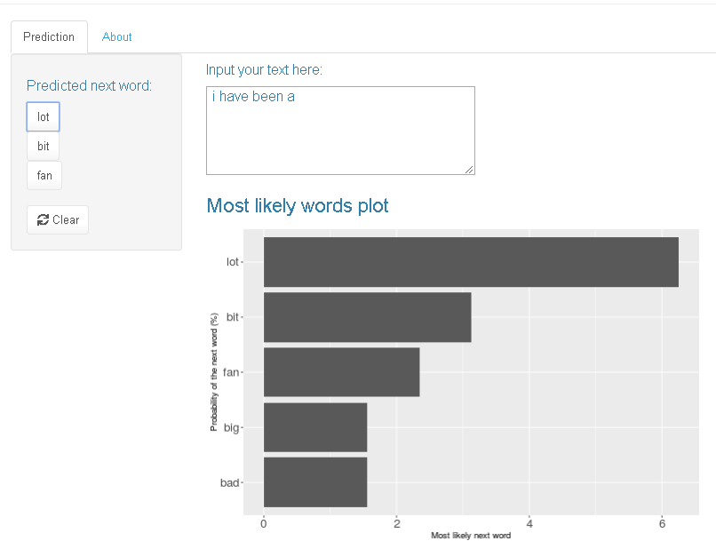

Next Word Predictor App
================

## Introduction

In the fields of computational linguistics and probability, an **n-gram
is a contiguous sequence of n items** from a given sample of text or
speech. The items can be **phonemes, syllables, letters, words or base
pairs** according to the application. The n-grams typically are
collected from a **text or speech corpus.** (
[Wikipedia](https://en.wikipedia.org/wiki/N-gram) ).

An n-gram model is a type of **probabilistic language model for
predicting the next item** in such a sequence in the form of a (n − 1) –
order Markov model. n-gram models are now widely used in probability,
communication theory, computational linguistics (for instance,
statistical natural language processing), computational biology (for
instance, biological sequence analysis), and data compression. (
[Coursera](https://www.coursera.org/learn/natural-language-processing/lecture/UnEHs/07-01-noisy-channel-model-8-33)
).

Based on **N-grams tables, builded from gathered online text**, a **next
word predictor application** was built. It **returns the most likely
next word** based on the **last three words**, if it doesnt find a
likely matching word for this last three terms, them it will try to find
a match for the last two terms, or them for the last word. This is also
called “Stupid Backoff” (Brants et al 2007)
[PDF](https://www.aclweb.org/anthology/D07-1090.pdf).

  - [Working App
    URL](https://cdopazo.shinyapps.io/Dopazo_Next_word_predictor_app/)
  - [App Presentation
    URL](https://rpubs.com/Carlos_Dopazo/NextWordApp_Presentation)

* [See the n-gram code here](https://github.com/CDopazo/Project_portfolio/blob/master/R/Data%20web%20products/Next_word_predictor_app/coding/n_grams_prob.Rmd)

* [See the server code here](https://github.com/CDopazo/Project_portfolio/blob/master/R/Data%20web%20products/Next_word_predictor_app/coding/server.R)

* [See the UI code here](https://github.com/CDopazo/Project_portfolio/blob/master/R/Data%20web%20products/Next_word_predictor_app/coding/ui.R)

* [See the Next Word Generator Function code here](https://github.com/CDopazo/Project_portfolio/blob/master/R/Data%20web%20products/Next_word_predictor_app/coding/Next_word_Function_03.R)

## Dataset

The **dataset** for this next word prediction app was gathered from
**three sources:**

  - **Blogs**
  - **News**
  - **Twitter**

The **original data** set can be downloaded
[here:](https://d396qusza40orc.cloudfront.net/dsscapstone/dataset/Coursera-SwiftKey.zip)

The english language corpus combined over **580 MB of language
information**. Which summed up to over **half a billion characters.**

## How to use the Prediction App:

The prediction app has to TABS, the **Prediction TAB** and the **About
TAB.**

### Prediction TAB

This is where the prediction works, it has three important areas: **The
Side Buttons**, **The Text Area**, and the **Plot Area**.

#### Side Buttons (Predictions and Clear button):

These buttons are made to emulate the cellphone predictor apps, where
the next word prediction is printed on these buttons for the user to
click on instead of manual typing the prediction.

There are **three buttons** for the **three most likely next words**,
and a **Clear Button** that erase all the input text

#### Text Area:

Here is the area to input the text used for the prediction, user can
manual type, copy and paste, or use the side buttons to input text.

#### Plot Area:

This is a horizontal histogram of the probabilities of the most likely 5
words based on the input text

## About TAB:

Shows this page.

### Next word predictor APP Screenshoot:

#### R Packages:

  - Shiny
  - Shinythemes
  - NLP
  - tm
  - RWeka
  - ggplot2
  - utils
  - slam
