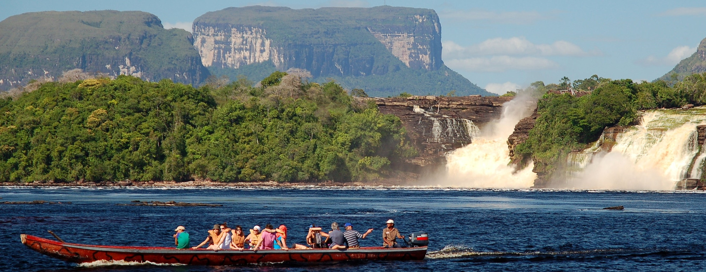
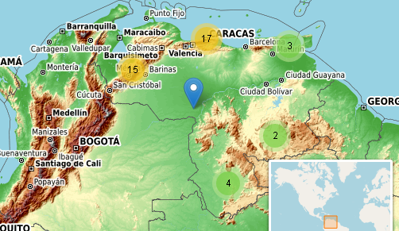

README
================

# Venezuela National Parks Interactive mapping

The national parks of **Venezuela** are **protected areas** in Venezuela
covering a wide range of habitats. In 2007 there were **42 national
parks**, covering **21.76% of Venezuela’s territory.**

Every Venezuela state has one or more national parks.

  - 5 national parks - **Lara**
  - 4 national parks - **Amazonas, Falcón, Mérida, Miranda, Portuguesa,
    and Táchira.**
  - 3 national parks - **Apure, Sucre, and Trujillo.**
  - 2 national parks - **Barinas, Bolívar, Carabobo, Distrito Capital,
    Guárico, Nueva Esparta, Yaracuy, and Zulia.**
  - 1 national park - **Anzoátegui, Aragua, Cojedes, Delta Amacuro,
    Federal Dependencies, Monagas, and Vargas.**

18 national parks are over 1000 km2; 15 over 2000 km2; 5 over 5000 km2
and 3 over 10,000 km2. The largest parks, in the Guayana Region, are
**Parima Tapirapecó National Park** (39,000 km2) and **Canaima National
Park** (30,000 km2).

## Venezuela National Parks map

#### How to use it:

  - The national parks are **clustered**, **zoom is need to target a
    single National park**
  - Every National Park icon has a **popup window with** a **photo** of
    the place, and an **URL linking to the Wikipedia** informative site
    of the National Park.
  - There is a working **world minimap** on the bottom right corner of
    the screen that you can try.

Try out the **working html map here:**

### [Venezuela NP map](https://cdopazo.github.io/publishing/np_map.html)

### Venezuela National Parks map screenshot.

[See the data manipulation code here](https://github.com/CDopazo/Project_portfolio/blob/master/R/Data%20web%20products/Venezuela_National_parks/coding/data_map.R)

[See the map code here](https://github.com/CDopazo/Project_portfolio/blob/master/R/Data%20web%20products/Venezuela_National_parks/coding/np_map.R)

### References:

<https://en.wikipedia.org/wiki/List_of_national_parks_of_Venezuela>
