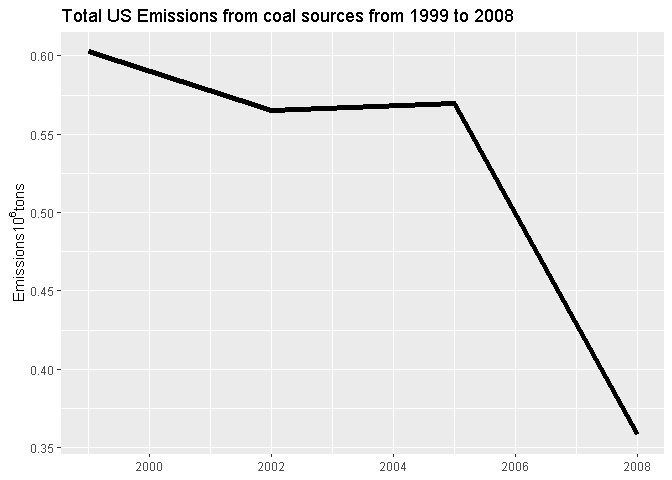

Air pollutant contaminant PM 2.5
================

## Introduction

Fine **particulate matter (PM 2.5)** is an **ambient air pollutant** for
which there is strong evidence that it is harmful to human health. In
the **United States, the Environmental Protection Agency (EPA)** is
tasked with setting national ambient air quality standards for fine PM
and for tracking the emissions of this pollutant into the atmosphere.
Approximatly every 3 years, the EPA releases its database on emissions
of PM 2.5. This database is known as the **National Emissions Inventory
(NEI)**. You can read more information about the NEI at the [EPA
National Emissions Inventory web
site](https://www.epa.gov/air-emissions-inventories/national-emissions-inventory-nei).

For **each year** and for **each type of PM source**, the NEI records
**how many tons of PM2.5** were emitted from that source over the course
of the **entire year**. The following data is for **1999, 2002, 2005,
and 2008**.

## The PM 2.5 Pollutant data:

Download Data here:
[Pollutant\_data](https://d396qusza40orc.cloudfront.net/exdata%2Fdata%2FNEI_data.zip)

The zip file contains two files:

### PM 2.5 Emissions Data (summarySCC\_PM25.rds) :

This file contains a data frame with all of the **PM2.5 emissions data
for 1999, 2002, 2005, and 2008**. For each year, the table contains
**number of tons of PM2.5** emitted from a specific **type of source**
for the entire **year**. Here are the first few rows.

    ##     fips      SCC Pollutant Emissions  type year
    ## 4  09001 10100401  PM25-PRI    15.714 POINT 1999
    ## 8  09001 10100404  PM25-PRI   234.178 POINT 1999
    ## 12 09001 10100501  PM25-PRI     0.128 POINT 1999
    ## 16 09001 10200401  PM25-PRI     2.036 POINT 1999
    ## 20 09001 10200504  PM25-PRI     0.388 POINT 1999
    ## 24 09001 10200602  PM25-PRI     1.490 POINT 1999

  - **fips:** A five-digit number (represented as a string) indicating
    the U.S. county
  - **SCC:** The name of the source as indicated by a digit string
  - **Pollutant:** A string indicating the pollutant
  - **Emissions:** Amount of PM2.5 emitted, in tons
  - **type:** The type of source (point, non-point, on-road, or
    non-road)
  - **year:** The year of emissions recorded

### Source Classification Code Table (Source\_Classification\_Code.rds):

This table provides a **mapping from the SCC digit** strings in the
Emissions table to the actual name of the PM2.5 source. The sources are
categorized in a few different ways from more general to more specific
and you may choose to explore whatever categories you think are most
useful. For example, source “10100101” is known as “Ext Comb /Electric
Gen /Anthracite Coal /Pulverized Coal”.

## Exploratory pollutant Data Analysis:

The overall goal here is to **explore the National Emissions Inventory
database** and see what it say about fine particulate matter pollution
in the United states over the 10-year period 1999–2008.

### Questions:

#### Have total emissions from PM 2.5 decreased in the United States from 1999 to 2008?

<!-- --><!-- -->

[See the plot code here](XXXXXX)

#### Have total emissions from PM 2.5 decreased in the Baltimore City, Maryland fips == “24510”) from 1999 to 2008?

<!-- --><!-- -->

[See the plot code here](XXXXXX)

#### Of the four types of sources indicated by the type (point, nonpoint, onroad, nonroad) variable, which of these four sources have seen decreases in emissions from 1999–2008 for Baltimore City? Which have seen increases in emissions from 1999–2008?

<!-- --><!-- -->

[See the plot code here](XXXXXX)

#### Across the United States, how have emissions from coal combustion-related sources changed from 1999–2008?

<!-- --><!-- -->

[See the plot code here](XXXXXX)

#### How have emissions from motor vehicle sources changed from 1999-2008 in Baltimore City?

<!-- --><!-- -->

[See the plot code here](XXXXXX)

#### Compare emissions from motor vehicle sources in Baltimore City with emissions from motor vehicle sources in Los Angeles County, California (fips == “06037”). Which city has seen greater changes over time in motor vehicle emissions?

<!-- --><!-- -->

[See the plot code here](XXXXXX)
