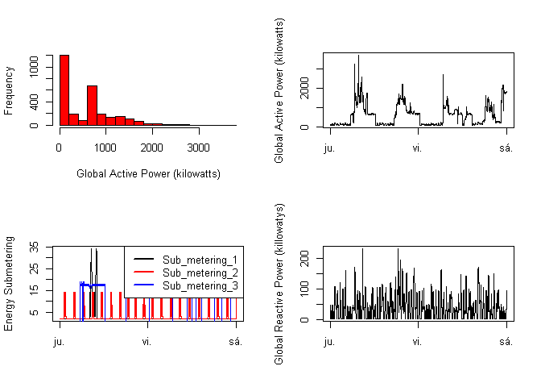

Individual household electric power consumption
================

## Introduction

An **exploratory data analisis** about some data from the **UC Irvine
Machine Learning Repository** was performed, this is a popular
repository for machine learning datasets. In particular the “Individual
household electric power consumption Data Set” was use, which is a data
set of **measurements of electric power consumption in one household
with a one-minute sampling rate over a period of almost 4 years**.
Different electrical quantities and some sub-metering values are
available.

Download the data:
[Electric\_power\_consumption](https://d396qusza40orc.cloudfront.net/exdata%2Fdata%2Fhousehold_power_consumption.zip)

The following descriptions of the 9 variables in the dataset are taken
from the [UCI web
site](https://archive.ics.uci.edu/ml/datasets/Individual+household+electric+power+consumption):

1.  **Date:** Date in format dd/mm/yyyy
2.  **Time:** time in format hh:mm:ss
3.  **Global\_active\_power:** household global minute-averaged active
    power (in kilowatt)
4.  **Global\_reactive\_power:** household global minute-averaged
    reactive power (in kilowatt)
5.  **Voltage:** minute-averaged voltage (in volt)
6.  **Global\_intensity:** household global minute-averaged current
    intensity (in ampere)
7.  **Sub\_metering\_1:** energy sub-metering No. 1 (in watt-hour of
    active energy). It corresponds to the kitchen, containing mainly a
    dishwasher, an oven and a microwave (hot plates are not electric but
    gas powered).
8.  **Sub\_metering\_2:** energy sub-metering No. 2 (in watt-hour of
    active energy). It corresponds to the laundry room, containing a
    washing-machine, a tumble-drier, a refrigerator and a light.
9.  **Sub\_metering\_3:** energy sub-metering No. 3 (in watt-hour of
    active energy). It corresponds to an electric water-heater and an
    air-conditioner.

[See the data manipulation code here](https://github.com/CDopazo/Project_portfolio/blob/master/R/Exploratory%20Data%20Analysis/Electric_power_consumption/coding/data_subsetting.R)

## Exploratory Data Analysis:

Our overall goal here is simply to **examine how household energy usage
varies over a 2-day period in February, 2007** this will be performed
with some ploting techniques.

### Household energy usage plots:

#### Plot 1: Frequency of Global active power (killowatts)

<!-- -->

[See the plot code here](https://github.com/CDopazo/Project_portfolio/blob/master/R/Exploratory%20Data%20Analysis/Electric_power_consumption/coding/plot_1.R)

This is the frequency of the global active power of the house among all
minutes in killowatts for the given days.

#### Plot 2: Global active power(killowats) VS time (days)

<!-- -->

[See the plot code here](https://github.com/CDopazo/Project_portfolio/blob/master/R/Exploratory%20Data%20Analysis/Electric_power_consumption/coding/plot_2.R)

This is a time serie for the given days of the household global
minute-averaged active power in killowatts.

#### Plot 3: Energy sub metering VS time (days)

<!-- -->

[See the plot code here](https://github.com/CDopazo/Project_portfolio/blob/master/R/Exploratory%20Data%20Analysis/Electric_power_consumption/coding/plot_3.R)

This is a time serie for the given days of the three energy submeterings
(kitchen,laundry room and electric water-heater/air conditioner).

#### Plot 4: Global reactive power (killowats) VS time(days)

<!-- -->

[See the plot code here](https://github.com/CDopazo/Project_portfolio/blob/master/R/Exploratory%20Data%20Analysis/Electric_power_consumption/coding/plot_4.R)

This is a time serie for the given days for the household global
minute-averaged reactive power in kilowatts.

#### Plot 5: Merged Plots 1 to 4

<!-- -->

[See the plot code here](https://github.com/CDopazo/Project_portfolio/blob/master/R/Exploratory%20Data%20Analysis/Electric_power_consumption/coding/plot_5.R)

This is a plot that merges all the previous plots.
