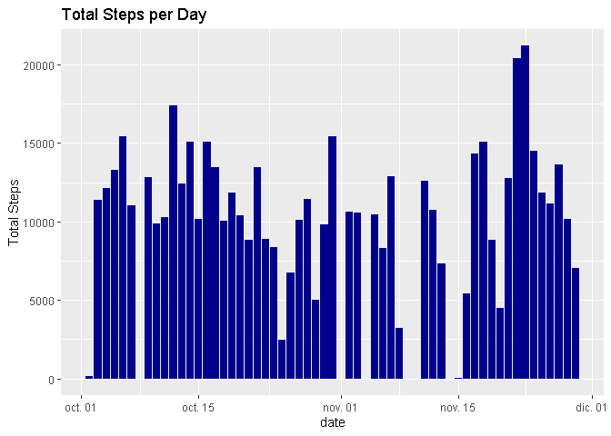
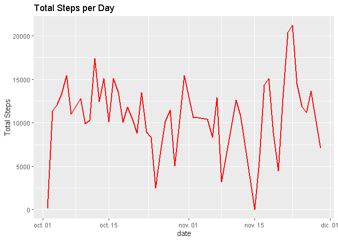
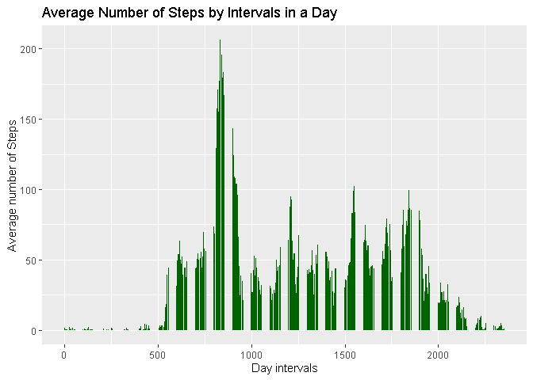
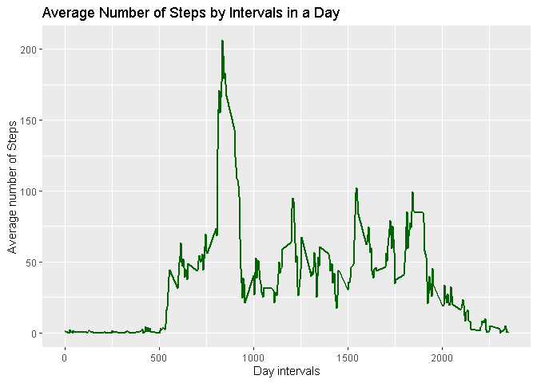
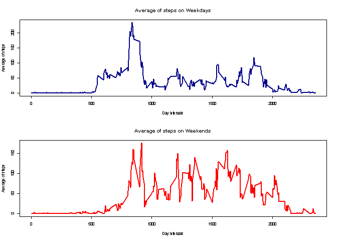
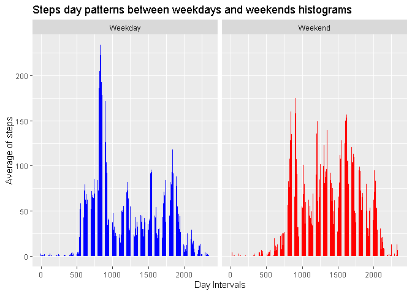
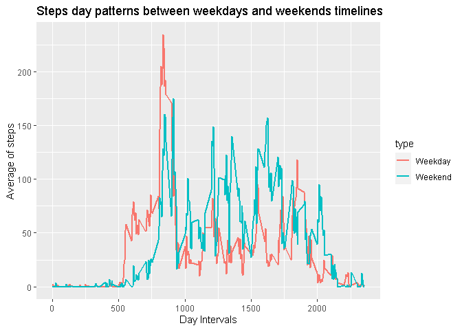

Human activity monitoring
================

## Introduction

It is now possible to collect a large amount of data about **personal
movement** using **activity monitoring devices** such as a
[Fitbit](https://www.fitbit.com/es/home), [Nike
Fuelband](https://en.wikipedia.org/wiki/Nike%2B_FuelBand#Discontinuation),
or [Jawbone Up](https://es.wikipedia.org/wiki/Jawbone). These type of
devices are part of the **“quantified self”** movement – a group of
enthusiasts who take **measurements about themselves regularly to
improve their health**, to find patterns in their behavior, or because
they are tech geeks. But these data remain under-utilized both because
the raw data are hard to obtain and there is a lack of statistical
methods and software for processing and interpreting the data.

## Data

The **analysis posted here** make use of data from a **personal activity
monitoring device**. This device collects data at **5 minute intervals
through out the day**. The **data consists of two months of data from an
anonymous individual** collected during the months of **October and
November, 2012** and include the **number of steps taken in 5 minute
intervals each day**.

Download the data here:
[Activity\_monitoring\_data](https://d396qusza40orc.cloudfront.net/repdata%2Fdata%2Factivity.zip)

The variables included in this dataset are:

**steps:** Number of steps taking in a 5-minute interval (missing values
are coded as NA). **date:** The date on which the measurement was taken
in YYYY-MM-DD format. **interval:** Identifier for the 5-minute interval
in which measurement was taken.

The dataset is stored in a comma-separated-value (CSV) file and there
are a total of **17,568 observations** in this dataset.

The overall goal here is to answer some questions about the human
activity, like: **steps taken per day, plot the activity pattern,
weekdays and weekends patterns, etc.**

[See the data manipulation code here](XXXXXX)

### Exploratory data analisis:

#### Total number of steps taken each day:

<!-- -->

[See the plot code here](XXXXXX)

<!-- -->

[See the plot code here](XXXXXX)

The **Average number of steps taken per day** is: and the median is:
10765

#### What is the average daily activity pattern?

<!-- --><!-- -->

[See the plot code here](XXXXXX)

<!-- -->

[See the plot code here](XXXXXX)

The **Day interval with the maximum number of steps** taken across all
days is the interval number: 835

#### Are there differences in activity patterns between weekdays and weekends?

<!-- -->

[See the plot code here](XXXXXX)

<!-- -->

[See the plot code here](XXXXXX)
