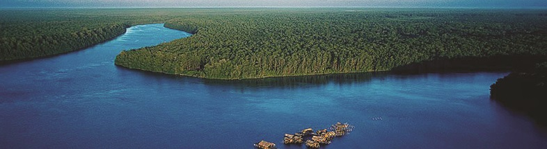

## Introduction

The **Orinoco Delta** is one of the **eight natural regions of Venezuela**. It covers the whole of **Delta Amacuro State** and a few square kilometers of **Monagas State and Sucre State**, **comprising all the mouths of the Orinoco**. It is divided into two sections: the principal, at the northernmost part of the system, located between **Caño Manamo** and the left shore of **Caño Araguao**, where the majority of villages are established, including the state capital Tucupita; and the secondary, between the right shore of Caño Araguao and Río Grande.

```{r echo=FALSE,message=FALSE, warning=FALSE,out.width="1000px"}
library(knitr)

```

The **marine diversity** in the marine region next to the orinoco delta its **very rich** and the overall goal of this project is to perform a **general caracterization** of the sea wildlife in this marine area.

## OBIS 

OBIS is a global open-access data and information clearing-house on marine biodiversity for science, conservation and sustainable development. The data used in this project was downloaded from OBIS site (you can visit it [here](https://obis.org/)) from the caribbean section associated with Venezuela (you can visit it [here](https://obis.org/area/280)). 

The **data on the OBIS site is constantly updated** with more observations every day. The data used in **this project was downloaded in 2018**, so if you visit the site today you will probably find more observations than those shown in this work.

```{r,echo=FALSE,warning=FALSE,message=FALSE}
source("coding/data_manipulation.R")
```

### 2018 OBIS Venezuela Marine registry

[See the data manipulation code here](XXXXXX)

```{r,fig.height=6,fig.width=6,echo=FALSE,warning=FALSE,message=FALSE}
source("coding/map_1.R")
```

[See the map code here](XXXXXX)

In this map every red dot represents a **observation of a specimen** registered be a university or institute and properly cataloged at a **published study** in a science magazine.

#### OBIS Orinoco's delta marine region:

```{r echo=FALSE,warning=FALSE,message=FALSE}
source("coding/map_2.R")
```

[See the map code here](XXXXXX)

Here we can see the **Orinoco's delta marine region** that is the target of this project. It counts with **1646 sigthings** or registers of marine wildlife.

#### Marine region of Orinoco's delta -  Diversity and Taxonomy:

In biological classification, taxonomic rank is the relative level of a group of organisms (a taxon) in a taxonomic hierarchy. Examples of taxonomic ranks are species, genus, family, order, class, phylum, kingdom, domain. ( [Wikipedia](https://en.wikipedia.org/wiki/Taxonomic_rank) ).

#### Taxonomy diversity:

```{r echo=FALSE,warning=FALSE,message=FALSE,fig.height=6,fig.width=6,}
source("coding/barplot_1.R")
```

[See the plot code here](XXXXXX)

In this chart we can see the **representation of the diversity** of the Orinoco's delta marine region, it counts with **270 diferent species** comming from **214 genera**, **141 Families**, 53 orders, 18 classes and 7 phyla.

#### Phylum pie chart:

In biology, a phylum is a level of classification or taxonomic rank below kingdom and above class.( [Wikipedia](https://en.wikipedia.org/wiki/Phylum)).

```{r,fig.height=10,fig.width=10,echo=FALSE,warning=FALSE,message=FALSE}
source("coding/plot_1.R")
```

[See the plot code here](XXXXXX)

In the previous plot it can be seen the **representatives of the most frequent phylums** in the orinoco delta. **Arhtropoda** is by far **the most frequent** phylum in the study region. This phylum includes animals like: Insects, **Crustaceans** or Aracnids.

#### Classes pie chart

```{r,fig.height=10,fig.width=10,echo=FALSE,warning=FALSE,message=FALSE}
source("coding/plot_2.R")
```

[See the plot code here](XXXXXX)

In this plot it can be clearly seen that the **Malacostraca** is the most frequent class at the Orinoco's delta marine region. This class includes crustaceans  animals like: **crabs, lobsters, krill, etc.**
