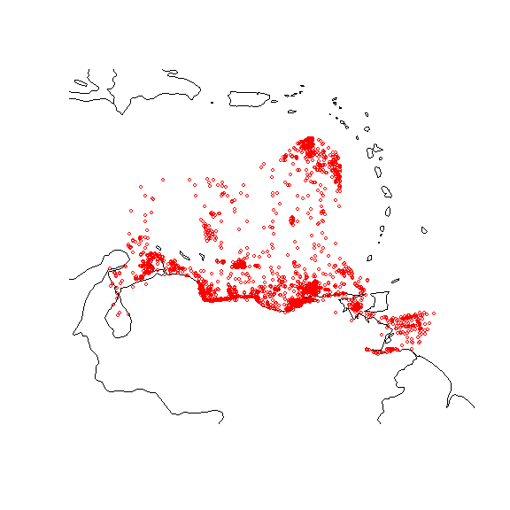
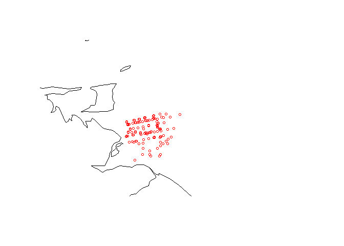
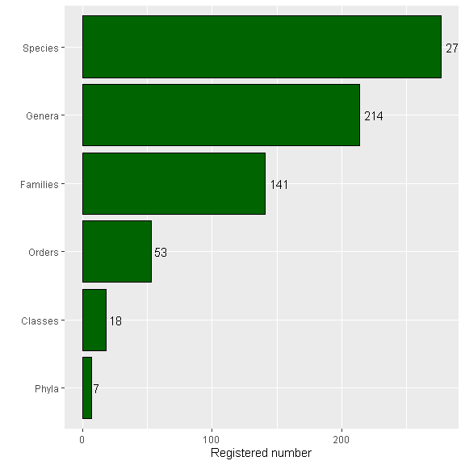
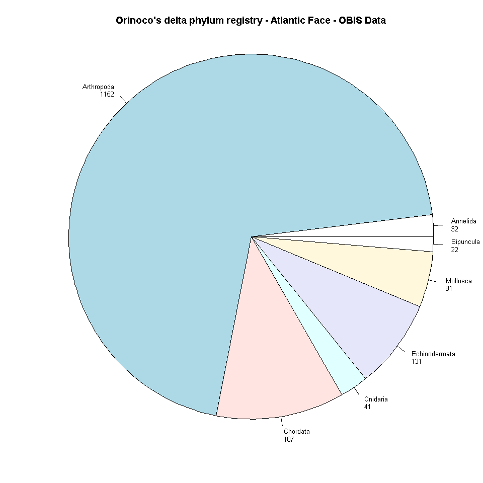
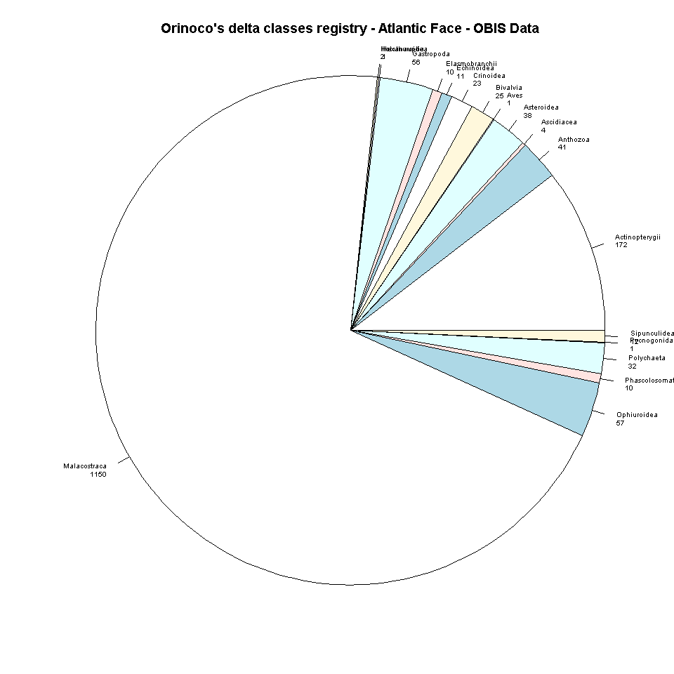

Venezuela Marine Caracterization - Orinoco Delta
================

## Introduction

The **Orinoco Delta** is one of the **eight natural regions of
Venezuela**. It covers the whole of **Delta Amacuro State** and a few
square kilometers of **Monagas State and Sucre State**, **comprising all
the mouths of the Orinoco**. It is divided into two sections: the
principal, at the northernmost part of the system, located between
**Caño Manamo** and the left shore of **Caño Araguao**, where the
majority of villages are established, including the state capital
Tucupita; and the secondary, between the right shore of Caño Araguao and
Río Grande.

The **marine diversity** in the marine region next to the orinoco delta
its **very rich** and the overall goal of this project is to perform a
**general caracterization** of the sea wildlife in this marine area.

## OBIS

OBIS is a global open-access data and information clearing-house on
marine biodiversity for science, conservation and sustainable
development. The data used in this project was downloaded from OBIS site
(you can visit it [here](https://obis.org/)) from the caribbean section
associated with Venezuela (you can visit it
[here](https://obis.org/area/280)).

The **data on the OBIS site is constantly updated** with more
observations every day. The data used in **this project was downloaded
in 2018**, so if you visit the site today you will probably find more
observations than those shown in this work.

### 2018 OBIS Venezuela Marine registry

[See the data manipulation code here](XXXXXX)

<!-- -->

[See the map code here](XXXXXX)

In this map every red dot represents a **observation of a specimen**
registered be a university or institute and properly cataloged at a
**published study** in a science magazine.

#### OBIS Orinoco’s delta marine region:

<!-- -->

[See the map code here](XXXXXX)

Here we can see the **Orinoco’s delta marine region** that is the target
of this project. It counts with **1646 sigthings** or registers of
marine wildlife.

#### Marine region of Orinoco’s delta - Diversity and Taxonomy:

In biological classification, taxonomic rank is the relative level of a
group of organisms (a taxon) in a taxonomic hierarchy. Examples of
taxonomic ranks are species, genus, family, order, class, phylum,
kingdom, domain. (
[Wikipedia](https://en.wikipedia.org/wiki/Taxonomic_rank) ).

#### Taxonomy diversity:

<!-- -->

[See the plot code here](XXXXXX)

In this chart we can see the **representation of the diversity** of the
Orinoco’s delta marine region, it counts with **270 diferent species**
comming from **214 genera**, **141 Families**, 53 orders, 18 classes and
7 phyla.

#### Phylum pie chart:

In biology, a phylum is a level of classification or taxonomic rank
below kingdom and above class.(
[Wikipedia](https://en.wikipedia.org/wiki/Phylum)).

<!-- -->

[See the plot code here](XXXXXX)

In the previous plot it can be seen the **representatives of the most
frequent phylums** in the orinoco delta. **Arhtropoda** is by far **the
most frequent** phylum in the study region. This phylum includes animals
like: Insects, **Crustaceans** or Aracnids.

#### Classes pie chart

<!-- -->

[See the plot code here](XXXXXX)

In this plot it can be clearly seen that the **Malacostraca** is the
most frequent class at the Orinoco’s delta marine region. This class
includes crustaceans animals like: **crabs, lobsters, krill, etc.**
