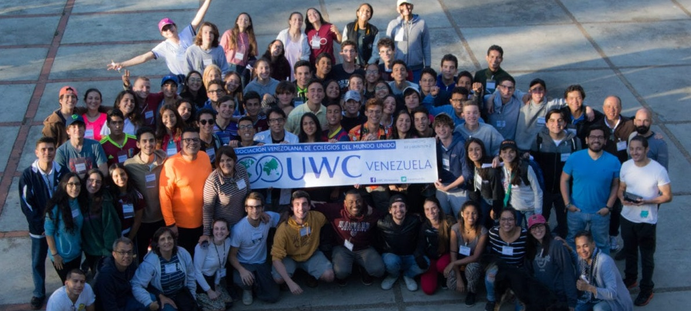
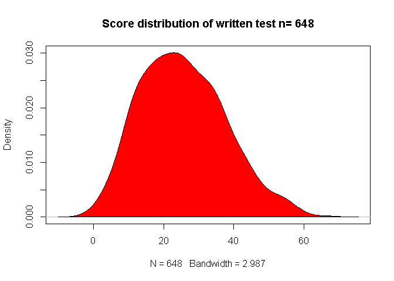
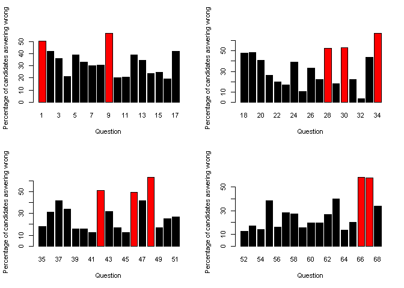
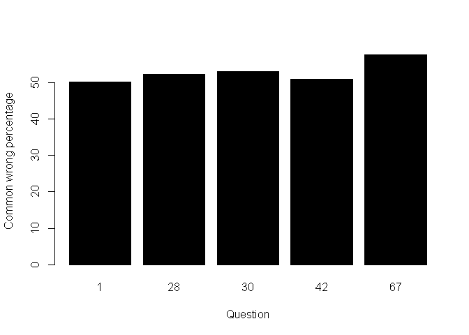
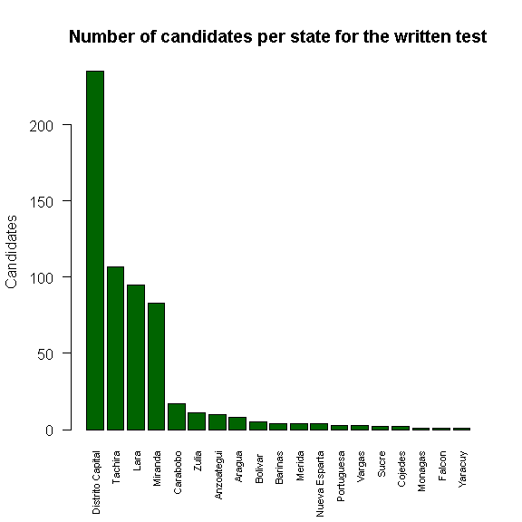
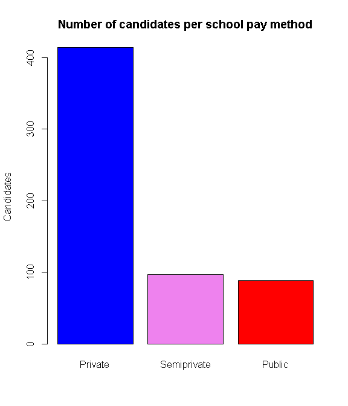
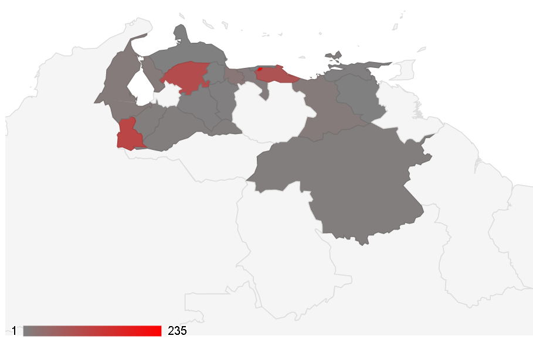
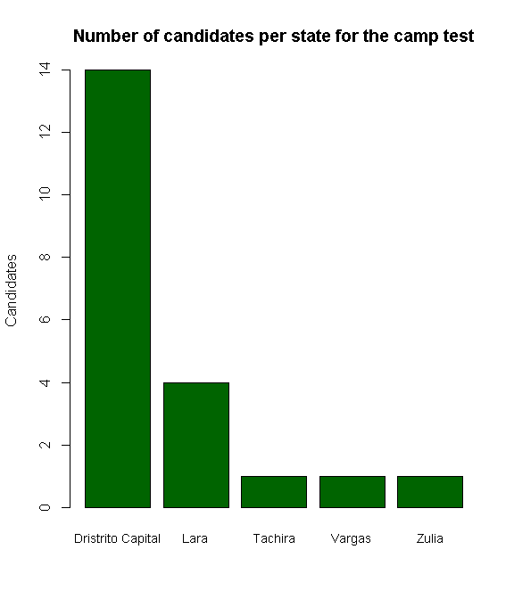
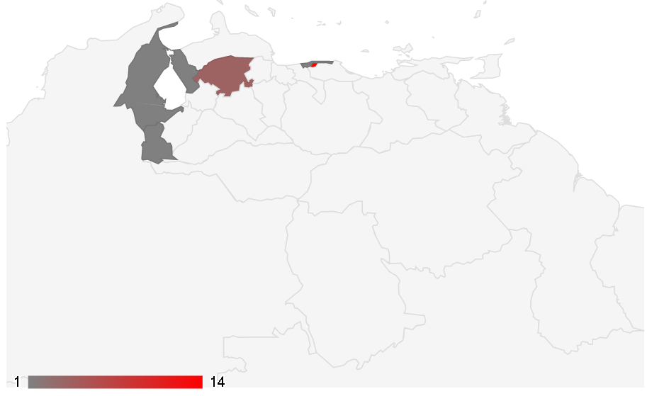

United World College Venezuelan test 2017
================

## Introduction

**UWC (or United World Colleges)** is a system of fee-paying independent
**schools and educational programs** with a stated mission of **“making
education a force to unite people, nations and cultures for peace and a
sustainable future”. ** [UWC official site](https://www.uwc.org/)

The organisation was founded on the **principles of German
educationalist Kurt Hahn.** Most of the schools and colleges offer
two-year residential programmes, **for people aged 16–19 years, during
which they complete the IB Diploma Programme**.

The organisation emphasizes the breadth of nationalities participating
in its programs. **UWC consists of 18 schools and colleges on five
continents**, several short educational programmes, and national
committees in **159 countries and territories**. UWC International is a
UK registered charity, governed by the International Board and the
International Council. The executive arm of the International Board is
the International Office, located in London, United Kingdom.

## Venezuela UWC test:

Every year **UWC Venezuela develops a test** in order to **select** the
venezuelan **candidates** who will participate in the **international
Scholarship programs Worldwide.** [UWC Venezuela
site](https://www.ven.uwc.org/)

The **test consist in two steps**, the first one is a **written test**
similar to the college admision test, with topics like: **mathematics,
logic analysis, reading comprehension, and common knowledge. The second
step is only for the candidates with the highest score on the written
test and consist on a **camp\*\* where candidates get interviewed and
verbally tested in topics more complex and deep like: **team work,
communication, emotional inteligence, empathy, xenophilia, tolerance,
etc.**

## Venezuela UWC test analysis:

The overall goal of this **analysis is to filter information** about the
**test scores** and the **diversity information** of the candidates.
This information will then be used by Central Management for
**continuous improvement of the selection process.**

In 2017 **648 candidates** tooked the written test.

[See the data manipulation code here](https://github.com/CDopazo/Project_portfolio/blob/master/R/Exploratory%20Data%20Analysis/UWC_test/UWC_test_2017/coding/data_loading.R)

### Written test analysis:

#### Written score density chart:

<!-- -->

[See the plot code here](https://github.com/CDopazo/Project_portfolio/blob/master/R/Exploratory%20Data%20Analysis/UWC_test/UWC_test_2017/coding/Plot_1.R)

This type of chart gives us an overview of the selection process. The
“majority” of the candidates had results **below the average score**
(85/2 = 42.5), evidencing an **arduous selection process** compared to
the candidates’ skills

#### Histograms: Questions Vs Wrong Percentage

<!-- -->

[See the plot code here](https://github.com/CDopazo/Project_portfolio/blob/master/R/Exploratory%20Data%20Analysis/UWC_test/UWC_test_2017/coding/Plot_2.R)

This type of analysis allows us to visually interpret **which questions
were answered wrongly by the majority**, this generates a vision of the
questions that are really serving as a filter. These questions are the
items in which the majority **(\> 50%) respond erroneously** . **Errors
may be a product of the candidate skill level.**

#### Histograms: Questions Vs Common Wrong Percentage

<!-- -->

[See the plot code here](https://github.com/CDopazo/Project_portfolio/blob/master/R/Exploratory%20Data%20Analysis/UWC_test/UWC_test_2017/coding/Plot_3.R)

This type of analysis is very similar to the previous one, however it is
more specific. Summarizes **the percentage of people per question who
wrongly answered the question using the same answer** (A, B, C, D, E).
These are the questions in which the majority (\> 50%) of the candidates
make mistakes using the sames wrongs answers, this could help to detect
unwanted confusing wording, **where the candidates are making mistakes
without this consequently reflecting their aptitude or skill level.**

### Candidates analysis

#### Written Test Candidates:

It is important to have an overview about the **origin of the
candidates** or **where they are comming from**, because the **objective
of the UWC** as an institution its to **give equal chance to all
candidates reaching the most states of the country**, so its important
to see the representation of each state and **if they are comming from
publics or privates institutes.**

<!-- -->

[See the plot code here](https://github.com/CDopazo/Project_portfolio/blob/master/R/Exploratory%20Data%20Analysis/UWC_test/UWC_test_2017/coding/Plot_4.R)

<!-- -->

[See the plot code here](https://github.com/CDopazo/Project_portfolio/blob/master/R/Exploratory%20Data%20Analysis/UWC_test/UWC_test_2017/coding/Plot_5.R)

Try out the **interactive map** here:

### [Test Heatmap](https://cdopazo.github.io/publishing/test2017.html)
[See the map code here](https://github.com/CDopazo/Project_portfolio/blob/master/R/Exploratory%20Data%20Analysis/UWC_test/UWC_test_2017/coding/camp_heatmap_html.R)

The same happens with the candidates who passes the written test and get
to the camp, its important to know **where are these candidates coming
from.**

<!-- -->

[See the plot code here](https://github.com/CDopazo/Project_portfolio/blob/master/R/Exploratory%20Data%20Analysis/UWC_test/UWC_test_2017/coding/Plot_6.R)

Try out the **interactive map** here:

### [Camp Heatmap](https://cdopazo.github.io/publishing/camp2017.html)
[See the map code here](https://github.com/CDopazo/Project_portfolio/blob/master/R/Exploratory%20Data%20Analysis/UWC_test/UWC_test_2017/coding/camp_heatmap_html.R)
