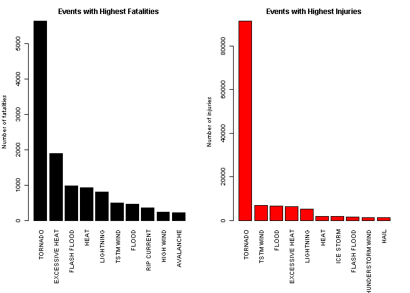
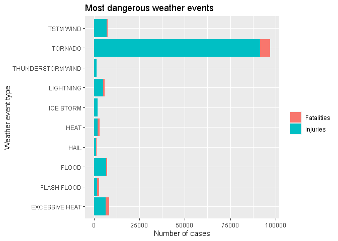
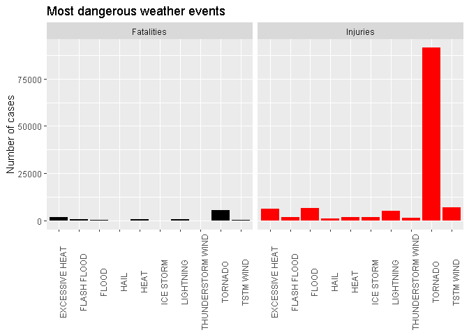
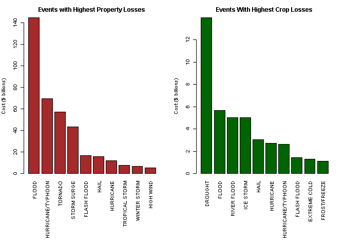
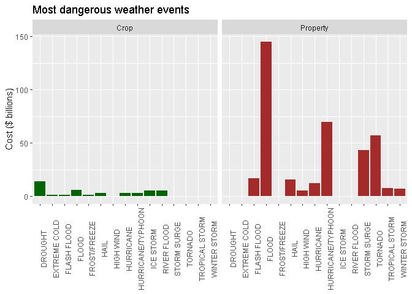

US Weather events:
================

## Introduction

**Storms and other severe weather events** can cause both public health
and economic problems for communities and municipalities. Many severe
events can result in **fatalities, injuries, and property damage**, and
**preventing** such outcomes to the extent possible is a key concern.

This analysis involves exploring the **U.S. National Oceanic and
Atmospheric Administration’s (NOAA) storm database**. This database
tracks **characteristics** of **major storms and weather events** in the
United States, including **when and where** they occur, as well as
estimates of any **fatalities, injuries, and property damage**.

### Data:

The data for this assignment come in the form of a comma-separated-value
file: Download here:
[Storm\_data](https://d396qusza40orc.cloudfront.net/repdata%2Fdata%2FStormData.csv.bz2)

There is also some documentation of the database available. Here you
will find how some of the variables are constructed/defined.

  - National Weather Service
    [Storm\_data\_documentation](https://d396qusza40orc.cloudfront.net/repdata%2Fpeer2_doc%2Fpd01016005curr.pdf)
  - National Climatic Data Center Storm Events
    [FAQ](https://d396qusza40orc.cloudfront.net/repdata%2Fpeer2_doc%2FNCDC%20Storm%20Events-FAQ%20Page.pdf)

The events in the database **start in the year 1950 and end in November
2011**. In the earlier years of the database there are generally fewer
events recorded, most likely due to a lack of good records. More recent
years should be considered more complete.

[See the data manipulation code here](https://github.com/CDopazo/Project_portfolio/blob/master/R/Exploratory%20Data%20Analysis/Weather_events/coding/data_reading_processing.R)

### Weather event Analysis:

The basic goal of this report is to explore the NOAA Storm Database and
answer some basic questions about severe weather events.

#### Across the United States, which types of events are most harmful with respect to population health?

<!-- -->

[See the plot code here](https://github.com/CDopazo/Project_portfolio/blob/master/R/Exploratory%20Data%20Analysis/Weather_events/coding/plot_1.R)

<!-- -->

[See the plot code here](https://github.com/CDopazo/Project_portfolio/blob/master/R/Exploratory%20Data%20Analysis/Weather_events/coding/plot_2.R)

<!-- -->

[See the plot code here](https://github.com/CDopazo/Project_portfolio/blob/master/R/Exploratory%20Data%20Analysis/Weather_events/coding/plot_3.R)

#### Across the United States, which types of events have the greatest economic consequences?

<!-- -->

[See the plot code here](https://github.com/CDopazo/Project_portfolio/blob/master/R/Exploratory%20Data%20Analysis/Weather_events/coding/plot_4.R)

<!-- -->

[See the plot code here](https://github.com/CDopazo/Project_portfolio/blob/master/R/Exploratory%20Data%20Analysis/Weather_events/coding/plot_5.R)
