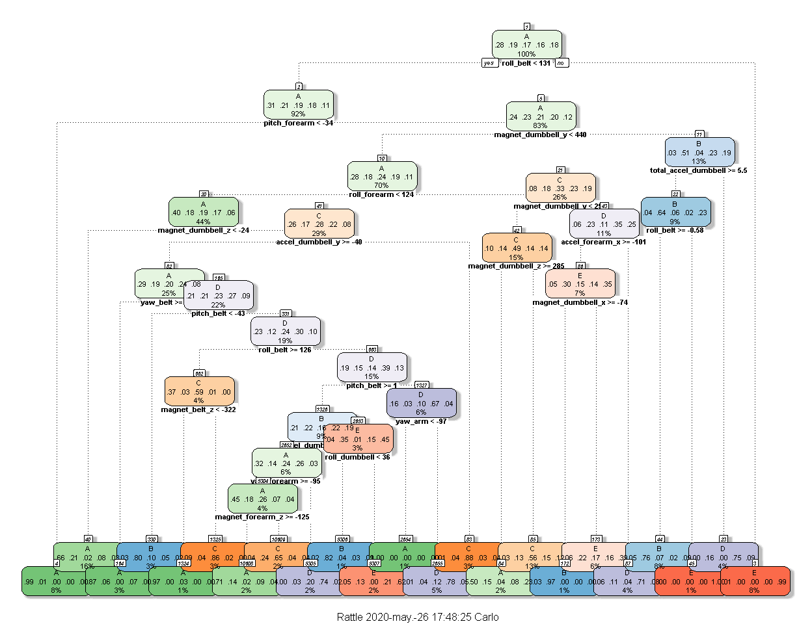
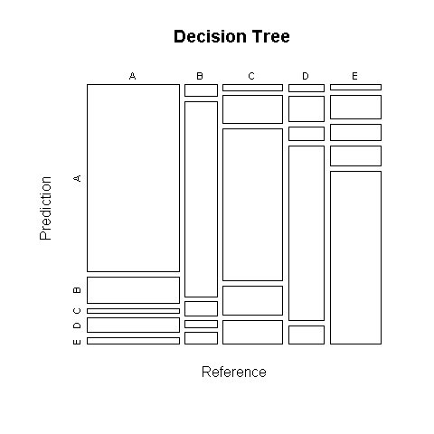
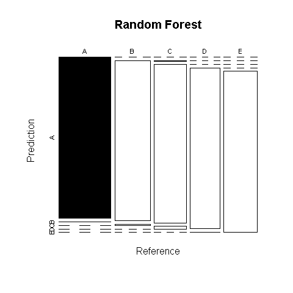

Human activity recognition - Machine learning model.
================

## Introduction

Using devices such as Jawbone Up, Nike FuelBand, and Fitbit it is now
possible to **collect a large amount of data about personal activity **
relatively inexpensively. These type of devices are part of the
**quantified self movement** – a group of enthusiasts who take
measurements about themselves regularly to improve their health, to find
patterns in their behavior, or because they are tech geeks.

One thing that people regularly do is **quantify how much of a
particular activity they do**, but they **rarely quantify how well they
do it**. In this project, **the overall goal is to use data from
accelerometers** on the belt, forearm, arm, and dumbell of 6
participants, **to predict if they are doing the work properly or
incorrectly**. They were asked to perform barbell lifts correctly and
incorrectly in 5 different ways. More information is available from the
website
[here](http://web.archive.org/web/20161224072740/http:/groupware.les.inf.puc-rio.br/har)
(see the section on the Weight Lifting Exercise Dataset).

## Data:

The data for this project come from this is a courtesy of “Ugulino, W.;
Cardador, D.; Vega, K.; Velloso, E.; Milidiu, R.; Fuks, H. Wearable
Computing: Accelerometers’ Data Classification of Body Postures and
Movements”
<http://web.archive.org/web/20161224072740/http:/groupware.les.inf.puc-rio.br/har>.

Download original data set here:
[HAR\_dataset](http://web.archive.org/web/20170907002202/http://groupware.les.inf.puc-rio.br/static/har/dataset-har-PUC-Rio-ugulino.zip)

Download the project data set already labeled here:
[training\_dataset](https://d396qusza40orc.cloudfront.net/predmachlearn/pml-training.csv)

The data set contains **19622 observations and 160 variables**.

[See the data manipulation code here](https://github.com/CDopazo/Project_portfolio/blob/master/R/Machine%20Learning/Human_activity_recognition/coding/data_manipulation.R)

## Model Building

### Decision Tree modeling:

**Decision tree learning** is one of the **predictive modelling**
approaches used in statistics, data mining and machine learning. It uses
a decision tree (as a predictive model) to go from observations about an
item (represented in the branches) to conclusions about the item’s
target value (represented in the leaves). Tree models where the target
variable can take a discrete set of values are called classification
trees; in these tree structures, **leaves represent class labels and
branches represent conjunctions of features that lead to those class
labels**. (learn more about Decision trees here:
[Wikipedia](https://en.wikipedia.org/wiki/Decision_tree_learning) )

    ## Confusion Matrix and Statistics
    ## 
    ##           Reference
    ## Prediction    A    B    C    D    E
    ##          A 1304  185   31  102   45
    ##          B   28  479   34   16   29
    ##          C   25  125  689  130  109
    ##          D   18   69   37  477   50
    ##          E   20   91   64   79  668
    ## 
    ## Overall Statistics
    ##                                          
    ##                Accuracy : 0.7376         
    ##                  95% CI : (0.725, 0.7498)
    ##     No Information Rate : 0.2845         
    ##     P-Value [Acc > NIR] : < 2.2e-16      
    ##                                          
    ##                   Kappa : 0.6659         
    ##                                          
    ##  Mcnemar's Test P-Value : < 2.2e-16      
    ## 
    ## Statistics by Class:
    ## 
    ##                      Class: A Class: B Class: C Class: D Class: E
    ## Sensitivity            0.9348  0.50474   0.8058  0.59328   0.7414
    ## Specificity            0.8966  0.97295   0.9039  0.95756   0.9365
    ## Pos Pred Value         0.7822  0.81741   0.6391  0.73272   0.7245
    ## Neg Pred Value         0.9719  0.89115   0.9566  0.92311   0.9415
    ## Prevalence             0.2845  0.19352   0.1743  0.16395   0.1837
    ## Detection Rate         0.2659  0.09768   0.1405  0.09727   0.1362
    ## Detection Prevalence   0.3399  0.11949   0.2198  0.13275   0.1880
    ## Balanced Accuracy      0.9157  0.73884   0.8549  0.77542   0.8390

<!-- -->

[See the plot code here](https://github.com/CDopazo/Project_portfolio/blob/master/R/Machine%20Learning/Human_activity_recognition/coding/Plot_1.R)

### Decision tree confusion matrix plot

In the field of machine learning and specifically the problem of
statistical classification, **a confusion matrix**, also known as an
error matrix, is a **specific table layout that allows visualization of
the performance of an algorithm**, typically a supervised learning one
(in unsupervised learning it is usually called a matching matrix).
**Each row of the matrix represents the instances in a predicted class**
while **each column represents the instances in an actual class**, or
reference (learn more about confusion matrix here:
[Wikipedia](https://en.wikipedia.org/wiki/Confusion_matrix) ).

<!-- -->

[See the plot code here](https://github.com/CDopazo/Project_portfolio/blob/master/R/Machine%20Learning/Human_activity_recognition/coding/Plot_2.R)

The accuracy for the **Decision Tree model is 0.7376**, its good but
maybe we can find a model that fits better our data. We will try the
Random Forest model.

## Random Forest modeling

**Random forests** or random decision forests are an ensemble learning
**method for classification, regression and other tasks that operate by
constructing a multitude of decision trees** at training time and
outputting the class that is the mode of the classes (classification) or
mean prediction (regression) of the individual trees. **Random decision
forests correct for decision trees’ habit of overfitting to their
training set** (learn more about Random Forest here:
[Wikipedia](https://en.wikipedia.org/wiki/Random_forest) ).

    ## 
    ## Call:
    ##  randomForest(x = x, y = y, mtry = param$mtry) 
    ##                Type of random forest: classification
    ##                      Number of trees: 500
    ## No. of variables tried at each split: 2
    ## 
    ##         OOB estimate of  error rate: 0.69%
    ## Confusion matrix:
    ##      A    B    C    D    E  class.error
    ## A 4182    2    0    0    1 0.0007168459
    ## B   11 2828    9    0    0 0.0070224719
    ## C    0   16 2549    2    0 0.0070120764
    ## D    0    0   48 2362    2 0.0207296849
    ## E    0    0    2    8 2696 0.0036954915

    ## Confusion Matrix and Statistics
    ## 
    ##           Reference
    ## Prediction    A    B    C    D    E
    ##          A 1395    1    0    0    0
    ##          B    0  946    8    0    0
    ##          C    0    2  847   14    0
    ##          D    0    0    0  790    2
    ##          E    0    0    0    0  899
    ## 
    ## Overall Statistics
    ##                                          
    ##                Accuracy : 0.9945         
    ##                  95% CI : (0.992, 0.9964)
    ##     No Information Rate : 0.2845         
    ##     P-Value [Acc > NIR] : < 2.2e-16      
    ##                                          
    ##                   Kappa : 0.993          
    ##                                          
    ##  Mcnemar's Test P-Value : NA             
    ## 
    ## Statistics by Class:
    ## 
    ##                      Class: A Class: B Class: C Class: D Class: E
    ## Sensitivity            1.0000   0.9968   0.9906   0.9826   0.9978
    ## Specificity            0.9997   0.9980   0.9960   0.9995   1.0000
    ## Pos Pred Value         0.9993   0.9916   0.9815   0.9975   1.0000
    ## Neg Pred Value         1.0000   0.9992   0.9980   0.9966   0.9995
    ## Prevalence             0.2845   0.1935   0.1743   0.1639   0.1837
    ## Detection Rate         0.2845   0.1929   0.1727   0.1611   0.1833
    ## Detection Prevalence   0.2847   0.1945   0.1760   0.1615   0.1833
    ## Balanced Accuracy      0.9999   0.9974   0.9933   0.9910   0.9989

### Random forest confusion matrix plot

<!-- -->

[See the plot code here](https://github.com/CDopazo/Project_portfolio/blob/master/R/Machine%20Learning/Human_activity_recognition/coding/Plot_3.R)

The accuracy for the **Random Forest model is 0.9945** almost 100% of
right guessing, 0,55% out of sample error\*\*, we dont need to look for
any other model, this one seems to be perfect.

## References:

  - **HAR Dataset** Ugulino, W.; Cardador, D.; Vega, K.; Velloso, E.;
    Milidiu, R.; Fuks, H. Wearable Computing: Accelerometers’ Data
    Classification of Body Postures and Movements. Proceedings of 21st
    Brazilian Symposium on Artificial Intelligence. Advances in
    Artificial Intelligence - SBIA 2012. In: Lecture Notes in Computer
    Science. , pp. 52-61. Curitiba, PR: Springer Berlin / Heidelberg,
    2012. ISBN 978-3-642-34458-9. DOI: 10.1007/978-3-642-34459-6\_6.
