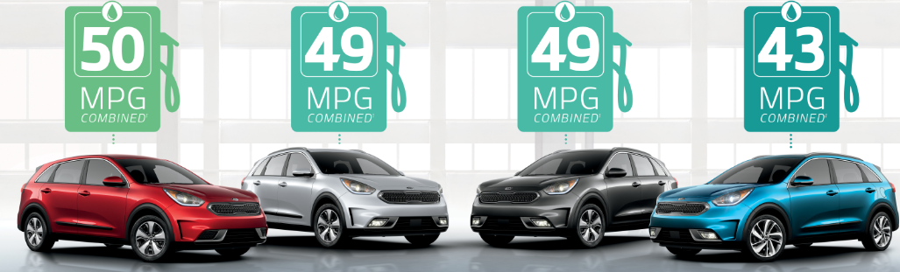

## Introduction

An exploration of the **relationship** between a **set of automobile desing and performance variables** (number of **cylinders**, **horsepower**, **weight**, etc) and the outcome (miles per gallon = **MPG**) has been performed.

```{r echo=FALSE,message=FALSE, warning=FALSE,out.width="1000px"}
library(knitr)

```

The overall goal in this analysis is to answer two questions:

1. Is an **automatic or manual transmission better** for Miles per galon(mpg)?
2. What is the **Miles per galon(mpg) difference** between automatic and manual transmissions?

This two questions will be adress along the work but will be **answered on the Conclusion section** at the end of the document.

## Data

For this analisis we will be using **mtcars data**, The data was extracted from the **1974 Motor Trend US magazine**, and comprises fuel consumption and 10 aspects of automobile design and performance for 32 automobiles (1973–74 models).

```{r echo=FALSE,message=FALSE, warning=FALSE,out.width="1000px"}
library(knitr)

```

Download the data here:  [mtcars.csv](https://forge.scilab.org/index.php/p/rdataset/source/tree/master/csv/datasets/mtcars.csv)

The data frame contains 32 observations on 11 (numeric) variables.

1. **cyl:** number of cylinders (factor: 4,6,8)
2. **disp:** displacement (cu.in.) (numerical)
3. **hp:** gross horsepower (numerical)
4. **drat:** rear axle ratio (numerical)
5. **wt:** weight (1000 pounds) (numerical)
6. **qsec:** 1/4 mile time (numerical)
7. **vs:** V/S, V-engine or Straight engine (factor: V,S)
8. **am:** transmission type (factor: automatic, manual)
9. **gear:** number of forwards gears (factor: 3,4,5)
10. **carb:** number of carburetors (factor: 1,2,3,4,5,6,7,8)

[see the data manipulation code here](XXXXXXXXXXXX)

The data look like this:

```{r,echo=FALSE, warning=FALSE,message=FALSE}
source("coding/data_manipulation.R")
head(mtcars)
```

Here is some overall information:

```{r,echo=FALSE, warning=FALSE,message=FALSE}
str(mtcars)
summary(mtcars)
```

## Data analysis:

The best way to adress the first question is to **plot the data and see if there is a possible difference** between the **Miles per galong (mpg)** of the automatic and manual **transmission** cars.

```{r,echo=FALSE, warning=FALSE,message=FALSE,fig.height=6,fig.width=10}
source("coding/Plot_1.R")
```

[see the plot code here](XXXXXXX)

The boxplot **appears to show that there is a difference**, but we can also try to plot the dispersion of the Miles per galon(mpg) data among all the cars and better see if there is more variation. 

```{r,echo=FALSE, warning=FALSE,message=FALSE,fig.height=6,fig.width=10}
source("coding/Plot_2.R")
```

[see the plot code here](XXXXXXX)

**Manual transmission exceed automatic transmission by and average of 7 Miles per galon (mpg)**. But is this a significant difference?. To be absolute sure that the average mpg of automatic cars are different from the Manual car a **T.Test was performed this is the output:**

The null hypothesis H0 (no difference between the means) with alpha= 0.05 is **REJECTED**

The p-value of **`r H_mpg$p.value`** suggest with a high probability that **automatics and manual transfmision cars are not equally in terms of the averages of the Miles per galon (mpg)**

But to actually quantify the difference between the two transmission type groups we will execute some further regression analysis.

## Simple linear regression:

A linear regressiona analysis was **performed to quantify the variance in Miles per galon (MPG)** of a car explained by the **change from automatic to manual transmission.**

```{r,echo=FALSE, warning=FALSE,message=FALSE}
summary(am_fit)
```

The coeficcient shows that **a change from manual to automatic transmission means a change of `r round(summary(am_fit)$coefficients[2],3)` in the Miles per galon(mpg).**

The question now is **why is Miles per galon(mpg) different in automatic and manual cars?** is really **the transmision that makes that difference?** or it is **a sum variables  not directly related to the transmision** that are levereging the **Miles per galon(mpg)?**.

From the Rsquare value = `r round(summary(am_fit)$r.squared,3)` it can be concluded that with a simple linear regression using transmission as a predictor we will just explain **`r round(summary(am_fit)$r.squared,3)*100`%** of the variance, **leaving around `r 100 - round(summary(am_fit)$r.squared,3)*100`% of uncertanty**, so we will need to build a better regression model, a multivariate one.

But first we need to think in which variables should we add to our model

```{r,echo=FALSE, warning=FALSE,message=FALSE,fig.height=9,fig.width=13}
source("coding/Plot_3.R")
```

[see the plot code here](XXXXXXX)

In this preliminary plot we can see that the variables most linealy related with the Miles per galon(mpg) are: 

* **cyl:** number of cylinders.
* **disp:** displacement (inside piston volume').
* **hp:** gross horsepower.
* **wt:** weight (1000 pounds)

```{r,echo=FALSE,message=FALSE,warning=FALSE,fig.height=10,fig.width=12}
source("coding/Plot_4.R")
```

[see the plot code here](XXXXXXX)

Better correlation between these parameters can be seen in this multi-plot, they are **very correlated to the Miles per galon(mpg) and to each other**. Thats why a deep analysis of these correlations has to be performed in order to **extract the minimum number of variables** that **explain the greatest variation of the Miles per galon (mpg)** of the cars.

Also an analysis of variance was performed: 
```{r,echo=FALSE, warning=FALSE,message=FALSE}
summary(VarAna)
```

The **variables with the lowest p-value will be the ones with the highest correlation**, and those should be included in our model to explain the variance. **The selected variables are: Cylinders (cyl), Weight(wt) and Displacement (disp).**

## Multiple Linear Regression:

### First multiple linear regression:

A **multiple linear regression was performed** with the target parameters located in the previous section. This regression is a multi-linear expression for the **prediction of Miles per galon(mpg)** of the cars **based on the values of the variables: Number of cylinders (cyl) and Weight (wt) and displacement (disp).**

```{r,echo=FALSE, warning=FALSE,message=FALSE}
summary(multi_fit_1)
```

The r^2^ for this model is **`r round(summary(multi_fit_1)$r.squared,3)`** which means that this model explains **`r round(summary(multi_fit_1)$r.squared,3)*100`%** of the variation in Miles per galon(mpg).

The multi linear model shows that the variable **displacement** is not very correlated with the mpg, the p-value is **`r round(summary(multi_fit_1)$coefficients[19],3)`** which means that theres is **no a significant relationship of the displacement with the Miles per galon(mpg)** and more data is needed to make it significant. Also the coeficcient for disp is **`r round(summary(multi_fit_1)$coefficients[4],3)`** which we can interepret as, when other variables are held constant, a change of 1 unit(one) in the displacement  means a change of  **`r round(summary(multi_fit_1)$coefficients[4],3)`** units on the mpg. In other words, if we had two identical cars but one has the minimum displacement (which is `r min(mtcars$disp)`) and the other has the maximum (which is `r max(mtcars$disp)`) the difference in the mpg of those cars will be only 0.687 mpg which represent only the 2.92% of the diference between the maximum and the minimum Miles per galon(mpg) data. Thats why **removing the displacement(disp)** from the model may be a good idea to **improve the accuracy of the model.**

## Second multiple linear regression

A **second linear regression** was performed, this regression is a linear expression for the **prediction of Miles per galon(MPG)** of the cars **based on the values of the variables: Number of cylinders (cyl) and Weight (wt).**

```{r,echo=FALSE, warning=FALSE,message=FALSE}
summary(multi_fit_2)
```

In this second multi-linear model we can see that all the variables seen to be significantly correlated with the Miles per galon, all the p-values of the F.test are way below the alpha=0.05.

### Model selection, selecting the best fit model:

**The Akaike’s information criterion** - AIC (Akaike, 1974) and the **Bayesian information criterion** - BIC (Schwarz, 1978) are measures of the **goodness of fit of an estimated statistical model** and can also be used for **model selection.**

In estimating the amount of information lost by a model, AIC deals with the **trade-off between the goodness of fit of the model and the simplicity of the model**. In other words, AIC **deals with both the risk of overfitting and the risk of underfitting**.  ( see more here: [Wikipedia](https://en.wikipedia.org/wiki/Akaike_information_criterion) )

Therefore if we compare the AIC and BIC for the performed models (simple linear model, and first and second multilinear model) we obtain this results:

* **Simple linear model AIC:** `r simple_AIC`
* **Simple linear model BIC:** `r simple_BIC`

* **First multi-linear model AIC:** `r multi_1_AIC`
* **First multi-linear model BIC:** `r multi_1_BIC`

* **Second multi-linear model AIC:** `r multi_2_AIC`
* **Second multi-linear model BIC:** `r multi_2_BIC`

The **lower the best for the AIC and BIC** so the last multi-linear model seems to fit better the data, and it explains **`r round(summary(multi_fit_2)$r.squared,3)*100`%** of the variance in Miles per galon(mpg)

Its **important to highlight that the transmission is not included in this last model**, because it was discarded by his **low significant influent** in the Miles per galon(mpg) output.

### Residual analysis of the best fit regression:

An analysis of the **residuals of the second multi-linear regression** was performed, the following plots show it.

```{r,echo=FALSE,warning=FALSE,message=FALSE,fig.height=9,fig.width=13}
source("coding/plot_5.R")
```

[see the plot code here](XXXXXXX)

There do not appear to be any incident with these plots; **the residuals dispersion appear to be randomly**, the **standardized residuals appear to be normally distributed**, and there **are not any highly influence of outliers.**

```{r,echo=FALSE,message=FALSE,warning=FALSE,fig.height=4,fig.width=8}
source("coding/plot_6.R")
```

[see the plot code here](XXXXXXX)

This last plot definitely shows the overall **contribution of each correlated variable** to the Miles per galon(mpg), its **important to hightlight** again how the **type of transmision** (a change from manual to automatic) **do not contribute to the Miles per galon (mpg) output as much as the other variables.**

# Conclusion:

The first question about who is better between manual and automatic transmission in therms of Miles per galon(mpg) need to be adress in a general way. In this overall way of dealing with the data we can say that **the diference in Miles per galon (mpg) between the manual and automatic transmission is around `r round(summary(am_fit)$coefficients[2],3)` mpg**, beeing **the manual the ones who exceed automatic transmition**, meaning that **automatic, in a general way, are better and more eficient in terms of Miles per galon.**

Nevertheless its **important to hightligh that the type of transmission is not the best predictor for the Miles per galon(mpg**, other variables like the **Weight or the number of cylinders are more statisticaly significantly related to the Miles per galon (mpg)** than the transmission type.

