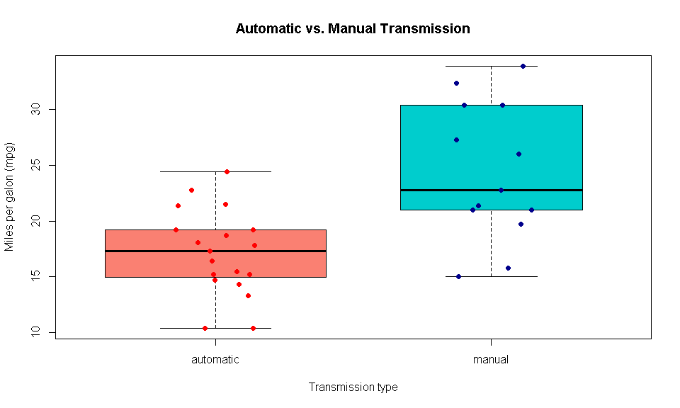
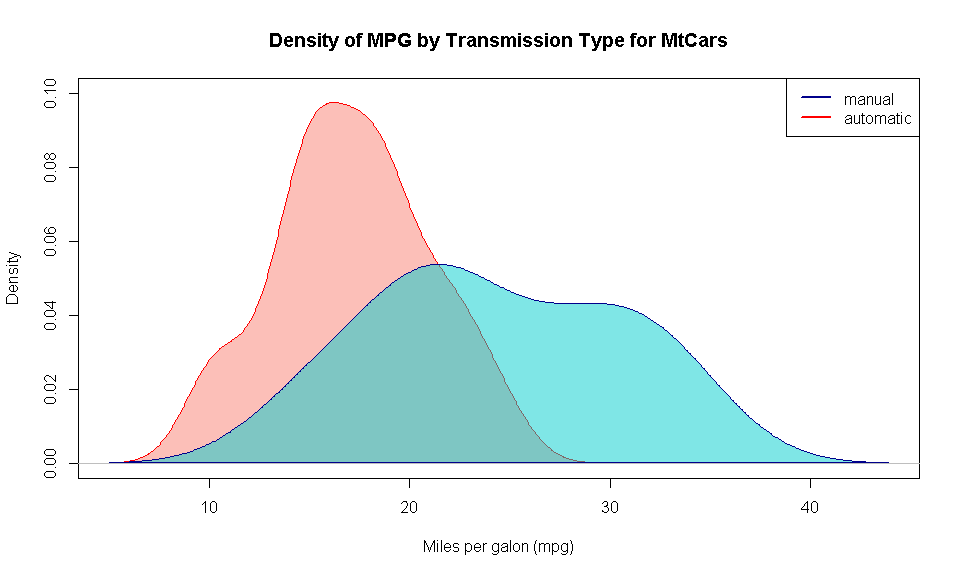
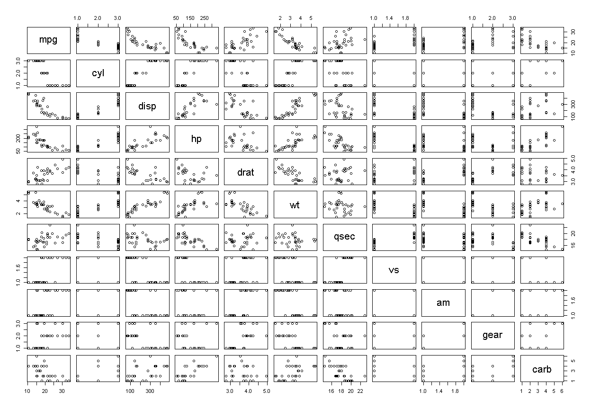
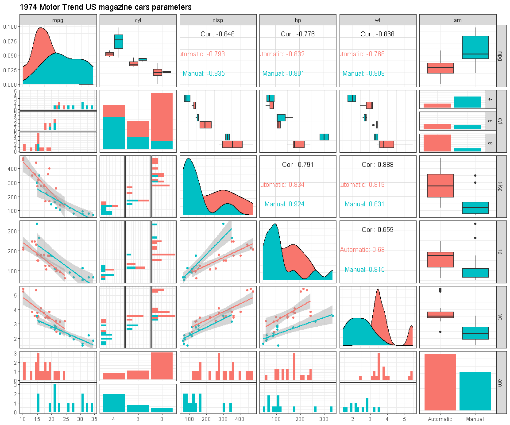
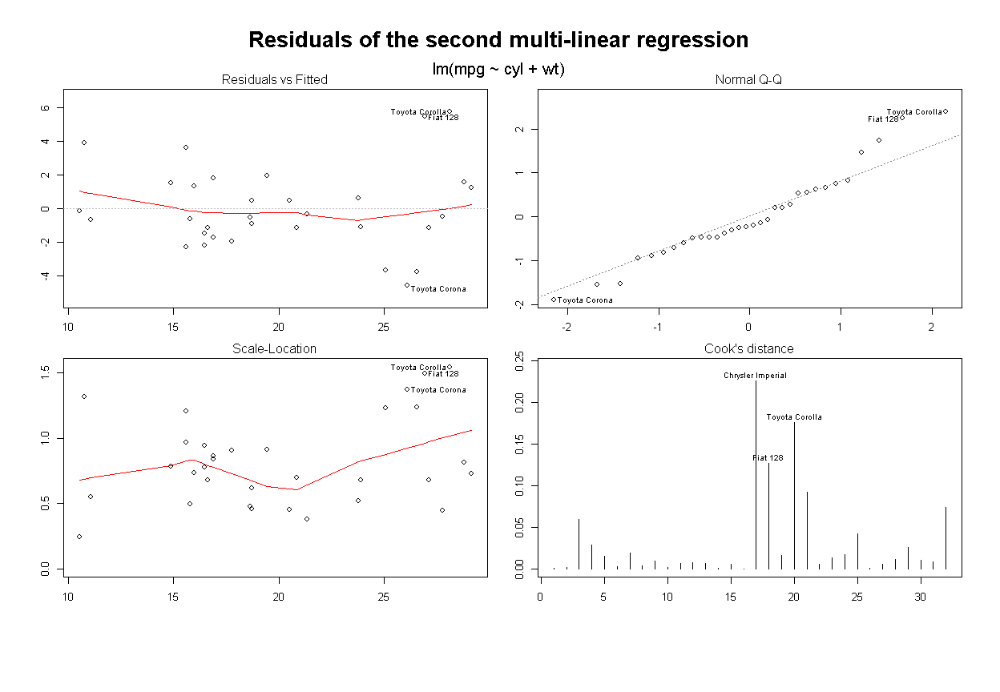
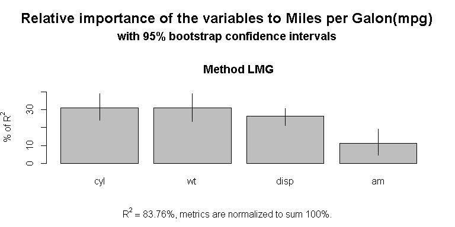

Motor Trend: Automatic vs Manual transmission.
================

## Introduction

An exploration of the **relationship** between a **set of automobile
desing and performance variables** (number of **cylinders**,
**horsepower**, **weight**, etc) and the outcome (miles per gallon =
**MPG**) has been performed.

The overall goal in this analysis is to answer two questions:

1.  Is an **automatic or manual transmission better** for Miles per
    galon(mpg)?
2.  What is the **Miles per galon(mpg) difference** between automatic
    and manual transmissions?

This two questions will be adress along the work but will be **answered
on the Conclusion section** at the end of the document.

## Data

For this analisis we will be using **mtcars data**, The data was
extracted from the **1974 Motor Trend US magazine**, and comprises fuel
consumption and 10 aspects of automobile design and performance for 32
automobiles (1973–74 models).

Download the data here:
[mtcars.csv](https://forge.scilab.org/index.php/p/rdataset/source/tree/master/csv/datasets/mtcars.csv)

The data frame contains 32 observations on 11 (numeric) variables.

1.  **cyl:** number of cylinders (factor: 4,6,8)
2.  **disp:** displacement (cu.in.) (numerical)
3.  **hp:** gross horsepower (numerical)
4.  **drat:** rear axle ratio (numerical)
5.  **wt:** weight (1000 pounds) (numerical)
6.  **qsec:** 1/4 mile time (numerical)
7.  **vs:** V/S, V-engine or Straight engine (factor: V,S)
8.  **am:** transmission type (factor: automatic, manual)
9.  **gear:** number of forwards gears (factor: 3,4,5)
10. **carb:** number of carburetors (factor: 1,2,3,4,5,6,7,8)

[see the data manipulation code here](https://github.com/CDopazo/Project_portfolio/blob/master/R/Regression%20Models/Cars_Autovsmanual/coding/data_manipulation.R)

The data look like this:

    ##                    mpg cyl disp  hp drat    wt  qsec vs        am gear carb
    ## Mazda RX4         21.0   6  160 110 3.90 2.620 16.46  0    Manual    4    4
    ## Mazda RX4 Wag     21.0   6  160 110 3.90 2.875 17.02  0    Manual    4    4
    ## Datsun 710        22.8   4  108  93 3.85 2.320 18.61  1    Manual    4    1
    ## Hornet 4 Drive    21.4   6  258 110 3.08 3.215 19.44  1 Automatic    3    1
    ## Hornet Sportabout 18.7   8  360 175 3.15 3.440 17.02  0 Automatic    3    2
    ## Valiant           18.1   6  225 105 2.76 3.460 20.22  1 Automatic    3    1

Here is some overall information:

    ## 'data.frame':    32 obs. of  11 variables:
    ##  $ mpg : num  21 21 22.8 21.4 18.7 18.1 14.3 24.4 22.8 19.2 ...
    ##  $ cyl : Factor w/ 3 levels "4","6","8": 2 2 1 2 3 2 3 1 1 2 ...
    ##  $ disp: num  160 160 108 258 360 ...
    ##  $ hp  : num  110 110 93 110 175 105 245 62 95 123 ...
    ##  $ drat: num  3.9 3.9 3.85 3.08 3.15 2.76 3.21 3.69 3.92 3.92 ...
    ##  $ wt  : num  2.62 2.88 2.32 3.21 3.44 ...
    ##  $ qsec: num  16.5 17 18.6 19.4 17 ...
    ##  $ vs  : Factor w/ 2 levels "0","1": 1 1 2 2 1 2 1 2 2 2 ...
    ##  $ am  : Factor w/ 2 levels "Automatic","Manual": 2 2 2 1 1 1 1 1 1 1 ...
    ##  $ gear: Factor w/ 3 levels "3","4","5": 2 2 2 1 1 1 1 2 2 2 ...
    ##  $ carb: Factor w/ 6 levels "1","2","3","4",..: 4 4 1 1 2 1 4 2 2 4 ...

    ##       mpg        cyl         disp             hp             drat      
    ##  Min.   :10.40   4:11   Min.   : 71.1   Min.   : 52.0   Min.   :2.760  
    ##  1st Qu.:15.43   6: 7   1st Qu.:120.8   1st Qu.: 96.5   1st Qu.:3.080  
    ##  Median :19.20   8:14   Median :196.3   Median :123.0   Median :3.695  
    ##  Mean   :20.09          Mean   :230.7   Mean   :146.7   Mean   :3.597  
    ##  3rd Qu.:22.80          3rd Qu.:326.0   3rd Qu.:180.0   3rd Qu.:3.920  
    ##  Max.   :33.90          Max.   :472.0   Max.   :335.0   Max.   :4.930  
    ##        wt             qsec       vs             am     gear   carb  
    ##  Min.   :1.513   Min.   :14.50   0:18   Automatic:19   3:15   1: 7  
    ##  1st Qu.:2.581   1st Qu.:16.89   1:14   Manual   :13   4:12   2:10  
    ##  Median :3.325   Median :17.71                         5: 5   3: 3  
    ##  Mean   :3.217   Mean   :17.85                                4:10  
    ##  3rd Qu.:3.610   3rd Qu.:18.90                                6: 1  
    ##  Max.   :5.424   Max.   :22.90                                8: 1

## Data analysis:

The best way to adress the first question is to **plot the data and see
if there is a possible difference** between the **Miles per galong
(mpg)** of the automatic and manual **transmission** cars.

<!-- -->

[see the plot code here](https://github.com/CDopazo/Project_portfolio/blob/master/R/Regression%20Models/Cars_Autovsmanual/coding/Plot_1.R)

The boxplot **appears to show that there is a difference**, but we can
also try to plot the dispersion of the Miles per galon(mpg) data among
all the cars and better see if there is more variation.

<!-- -->

[see the plot code here](https://github.com/CDopazo/Project_portfolio/blob/master/R/Regression%20Models/Cars_Autovsmanual/coding/Plot_2.R)

**Manual transmission exceed automatic transmission by and average of 7
Miles per galon (mpg)**. But is this a significant difference?. To be
absolute sure that the average mpg of automatic cars are different from
the Manual car a **T.Test was performed this is the output:**

The null hypothesis H0 (no difference between the means) with alpha=
0.05 is **REJECTED**

The p-value of **0.0013736** suggest with a high probability that
**automatics and manual transfmision cars are not equally in terms of
the averages of the Miles per galon (mpg)**

But to actually quantify the difference between the two transmission
type groups we will execute some further regression analysis.

## Simple linear regression:

A linear regressiona analysis was **performed to quantify the variance
in Miles per galon (MPG)** of a car explained by the **change from
automatic to manual transmission.**

    ## 
    ## Call:
    ## lm(formula = mpg ~ am, data = mtcars)
    ## 
    ## Residuals:
    ##     Min      1Q  Median      3Q     Max 
    ## -9.3923 -3.0923 -0.2974  3.2439  9.5077 
    ## 
    ## Coefficients:
    ##             Estimate Std. Error t value Pr(>|t|)    
    ## (Intercept)   17.147      1.125  15.247 1.13e-15 ***
    ## amManual       7.245      1.764   4.106 0.000285 ***
    ## ---
    ## Signif. codes:  0 '***' 0.001 '**' 0.01 '*' 0.05 '.' 0.1 ' ' 1
    ## 
    ## Residual standard error: 4.902 on 30 degrees of freedom
    ## Multiple R-squared:  0.3598, Adjusted R-squared:  0.3385 
    ## F-statistic: 16.86 on 1 and 30 DF,  p-value: 0.000285

The coeficcient shows that **a change from manual to automatic
transmission means a change of 7.245 in the Miles per galon(mpg).**

The question now is **why is Miles per galon(mpg) different in automatic
and manual cars?** is really **the transmision that makes that
difference?** or it is **a sum variables not directly related to the
transmision** that are levereging the **Miles per galon(mpg)?**.

From the Rsquare value = 0.36 it can be concluded that with a simple
linear regression using transmission as a predictor we will just explain
**36%** of the variance, **leaving around 64% of uncertanty**, so we
will need to build a better regression model, a multivariate one.

But first we need to think in which variables should we add to our model

<!-- -->

[see the plot code here](https://github.com/CDopazo/Project_portfolio/blob/master/R/Regression%20Models/Cars_Autovsmanual/coding/Plot_3.R)

In this preliminary plot we can see that the variables most linealy
related with the Miles per galon(mpg) are:

  - **cyl:** number of cylinders.
  - **disp:** displacement (inside piston volume’).
  - **hp:** gross horsepower.
  - **wt:** weight (1000 pounds)

<!-- -->

[see the plot code here](https://github.com/CDopazo/Project_portfolio/blob/master/R/Regression%20Models/Cars_Autovsmanual/coding/Plot_4.R)

Better correlation between these parameters can be seen in this
multi-plot, they are **very correlated to the Miles per galon(mpg) and
to each other**. Thats why a deep analysis of these correlations has to
be performed in order to **extract the minimum number of variables**
that **explain the greatest variation of the Miles per galon (mpg)** of
the cars.

Also an analysis of variance was performed:

    ##             Df Sum Sq Mean Sq F value   Pr(>F)    
    ## cyl          2  824.8   412.4  51.377 1.94e-07 ***
    ## disp         1   57.6    57.6   7.181   0.0171 *  
    ## hp           1   18.5    18.5   2.305   0.1497    
    ## drat         1   11.9    11.9   1.484   0.2419    
    ## wt           1   55.8    55.8   6.950   0.0187 *  
    ## qsec         1    1.5     1.5   0.190   0.6692    
    ## vs           1    0.3     0.3   0.038   0.8488    
    ## am           1   16.6    16.6   2.064   0.1714    
    ## gear         2    5.0     2.5   0.313   0.7361    
    ## carb         5   13.6     2.7   0.339   0.8814    
    ## Residuals   15  120.4     8.0                     
    ## ---
    ## Signif. codes:  0 '***' 0.001 '**' 0.01 '*' 0.05 '.' 0.1 ' ' 1

The **variables with the lowest p-value will be the ones with the
highest correlation**, and those should be included in our model to
explain the variance. **The selected variables are: Cylinders (cyl),
Weight(wt) and Displacement (disp).**

## Multiple Linear Regression:

### First multiple linear regression:

A **multiple linear regression was performed** with the target
parameters located in the previous section. This regression is a
multi-linear expression for the **prediction of Miles per galon(mpg)**
of the cars **based on the values of the variables: Number of cylinders
(cyl) and Weight (wt) and displacement (disp).**

    ## 
    ## Call:
    ## lm(formula = mpg ~ cyl + disp + wt, data = mtcars)
    ## 
    ## Residuals:
    ##     Min      1Q  Median      3Q     Max 
    ## -4.5965 -1.2361 -0.4855  1.4740  5.8043 
    ## 
    ## Coefficients:
    ##              Estimate Std. Error t value Pr(>|t|)    
    ## (Intercept) 34.041673   1.963039  17.341 3.66e-16 ***
    ## cyl6        -4.305559   1.464760  -2.939  0.00666 ** 
    ## cyl8        -6.322786   2.598416  -2.433  0.02186 *  
    ## disp         0.001715   0.013481   0.127  0.89972    
    ## wt          -3.306751   1.105083  -2.992  0.00586 ** 
    ## ---
    ## Signif. codes:  0 '***' 0.001 '**' 0.01 '*' 0.05 '.' 0.1 ' ' 1
    ## 
    ## Residual standard error: 2.603 on 27 degrees of freedom
    ## Multiple R-squared:  0.8375, Adjusted R-squared:  0.8135 
    ## F-statistic:  34.8 on 4 and 27 DF,  p-value: 2.726e-10

The r2 for this model is **0.838** which means that this
model explains **83.8%** of the variation in Miles per galon(mpg).

The multi linear model shows that the variable **displacement** is not
very correlated with the mpg, the p-value is **0.9** which means that
theres is **no a significant relationship of the displacement with the
Miles per galon(mpg)** and more data is needed to make it significant.
Also the coeficcient for disp is **0.002** which we can interepret as,
when other variables are held constant, a change of 1 unit(one) in the
displacement means a change of **0.002** units on the mpg. In other
words, if we had two identical cars but one has the minimum displacement
(which is 71.1) and the other has the maximum (which is 472) the
difference in the mpg of those cars will be only 0.687 mpg which
represent only the 2.92% of the diference between the maximum and the
minimum Miles per galon(mpg) data. Thats why **removing the
displacement(disp)** from the model may be a good idea to **improve the
accuracy of the model.**

## Second multiple linear regression

A **second linear regression** was performed, this regression is a
linear expression for the **prediction of Miles per galon(MPG)** of the
cars **based on the values of the variables: Number of cylinders (cyl)
and Weight (wt).**

    ## 
    ## Call:
    ## lm(formula = mpg ~ cyl + wt, data = mtcars)
    ## 
    ## Residuals:
    ##     Min      1Q  Median      3Q     Max 
    ## -4.5890 -1.2357 -0.5159  1.3845  5.7915 
    ## 
    ## Coefficients:
    ##             Estimate Std. Error t value Pr(>|t|)    
    ## (Intercept)  33.9908     1.8878  18.006  < 2e-16 ***
    ## cyl6         -4.2556     1.3861  -3.070 0.004718 ** 
    ## cyl8         -6.0709     1.6523  -3.674 0.000999 ***
    ## wt           -3.2056     0.7539  -4.252 0.000213 ***
    ## ---
    ## Signif. codes:  0 '***' 0.001 '**' 0.01 '*' 0.05 '.' 0.1 ' ' 1
    ## 
    ## Residual standard error: 2.557 on 28 degrees of freedom
    ## Multiple R-squared:  0.8374, Adjusted R-squared:   0.82 
    ## F-statistic: 48.08 on 3 and 28 DF,  p-value: 3.594e-11

In this second multi-linear model we can see that all the variables seen
to be significantly correlated with the Miles per galon, all the
p-values of the F.test are way below the alpha=0.05.

### Model selection, selecting the best fit model:

**The Akaike’s information criterion** - AIC (Akaike, 1974) and the
**Bayesian information criterion** - BIC (Schwarz, 1978) are measures of
the **goodness of fit of an estimated statistical model** and can also
be used for **model selection.**

In estimating the amount of information lost by a model, AIC deals with
the **trade-off between the goodness of fit of the model and the
simplicity of the model**. In other words, AIC **deals with both the
risk of overfitting and the risk of underfitting**. ( see more here:
[Wikipedia](https://en.wikipedia.org/wiki/Akaike_information_criterion)
)

Therefore if we compare the AIC and BIC for the performed models (simple
linear model, and first and second multilinear model) we obtain this
results:

  - **Simple linear model AIC:** 196.4843801

  - **Simple linear model BIC:** 200.8815878

  - **First multi-linear model AIC:** 158.6031561

  - **First multi-linear model BIC:** 167.3975715

  - **Second multi-linear model AIC:** 156.6223278

  - **Second multi-linear model BIC:** 163.9510073

The **lower the best for the AIC and BIC** so the last multi-linear
model seems to fit better the data, and it explains **83.7%** of the
variance in Miles per galon(mpg)

Its **important to highlight that the transmission is not included in
this last model**, because it was discarded by his **low significant
influent** in the Miles per galon(mpg) output.

### Residual analysis of the best fit regression:

An analysis of the **residuals of the second multi-linear regression**
was performed, the following plots show it.

<!-- -->

[see the plot code here](https://github.com/CDopazo/Project_portfolio/blob/master/R/Regression%20Models/Cars_Autovsmanual/coding/Plot_5.R)

There do not appear to be any incident with these plots; **the residuals
dispersion appear to be randomly**, the **standardized residuals appear
to be normally distributed**, and there **are not any highly influence
of outliers.**

<!-- -->

[see the plot code here](https://github.com/CDopazo/Project_portfolio/blob/master/R/Regression%20Models/Cars_Autovsmanual/coding/Plot_6.R)

This last plot definitely shows the overall **contribution of each
correlated variable** to the Miles per galon(mpg), its **important to
hightlight** again how the **type of transmision** (a change from manual
to automatic) **do not contribute to the Miles per galon (mpg) output as
much as the other variables.**

# Conclusion:

The first question about who is better between manual and automatic
transmission in therms of Miles per galon(mpg) need to be adress in a
general way. In this overall way of dealing with the data we can say
that **the diference in Miles per galon (mpg) between the manual and
automatic transmission is around 7.245 mpg**, beeing **the manual the
ones who exceed automatic transmition**, meaning that **automatic, in a
general way, are better and more eficient in terms of Miles per galon.**

Nevertheless its **important to hightligh that the type of transmission
is not the best predictor for the Miles per galon(mpg**, other variables
like the **Weight or the number of cylinders are more statisticaly
significantly related to the Miles per galon (mpg)** than the
transmission type.
