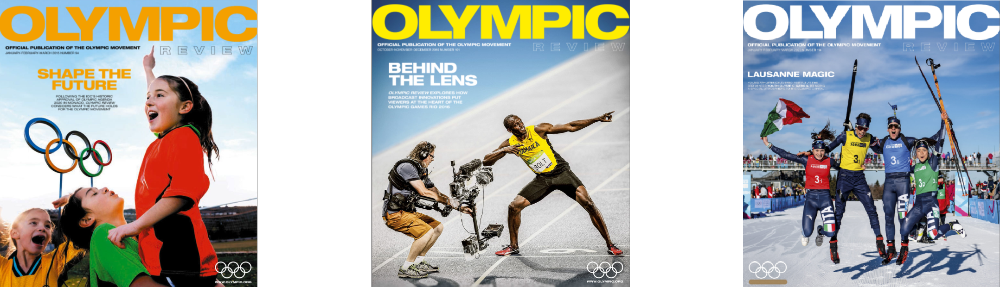
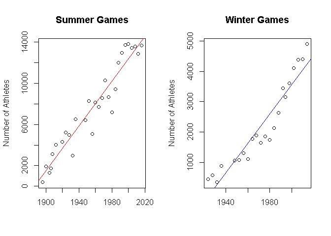
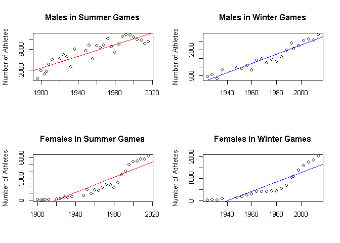

Olympics Records - Lineal Regression Analysis
================

# Introduction

An analysis of the Olympics data from all the olympics games, **120
years of data including winter and summer seasons** was performed in
order to highlight patterns or trends linked mainly with the
**performance and health of the athletes and insights about the event
organization and participation.**

This presentation insighs are proposals for the **Olympics Review
magazine** which is the official magazine of the Olympic Movement.
Published quarterly in English, French and Spanish, its content is a mix
of official news and information as well as more in-depth features on
topics of interest to the sporting movement.

[here](https://public.tableau.com/profile/carlos.dopazo.kozakas#!/vizhome/Olimpics_sport/OlympicsStory)
you can find a Tableau presentation using the results of this analysis.

Download the data
[here](https://www.dropbox.com/sh/0wqw8fmiwrzr8ef/AABQijjQM522INXX1FCdamzma?dl=0)

The Data looks like this:

    ##          City NOC     ID                                Name Sex Age Height
    ## 1 Albertville NED      5            Christine Jacoba Aaftink   F  25    185
    ## 2 Albertville CHN  70672                            Liu Yali   F  23     NA
    ## 3 Albertville GER 108374            Katja Seizinger (-Weber)   F  19    171
    ## 4 Albertville POL  95393                      Dariusz Platek   M  25    175
    ## 5 Albertville ITA  39868                    Pasquale Gesuito   M  32    180
    ## 6 Albertville SWE 130127 Pernilla Christina Wiberg (-Bjerke)   F  21    161
    ##   Weight        Team       Games Year Season         Sport
    ## 1     82 Netherlands 1992 Winter 1992 Winter Speed Skating
    ## 2     NA       China 1992 Winter 1992 Winter Alpine Skiing
    ## 3     64     Germany 1992 Winter 1992 Winter Alpine Skiing
    ## 4     76      Poland 1992 Winter 1992 Winter    Ice Hockey
    ## 5     85     Italy-2 1992 Winter 1992 Winter     Bobsleigh
    ## 6     68      Sweden 1992 Winter 1992 Winter Alpine Skiing
    ##                              Event  Medal      region notes Country
    ## 1 Speed Skating Women's 500 metres   <NA> Netherlands        France
    ## 2    Alpine Skiing Women's Super G   <NA>       China        France
    ## 3    Alpine Skiing Women's Super G Bronze     Germany        France
    ## 4      Ice Hockey Men's Ice Hockey   <NA>      Poland        France
    ## 5              Bobsleigh Men's Two   <NA>       Italy        France
    ## 6    Alpine Skiing Women's Super G   <NA>      Sweden        France
    ##   medal_number medal_factor
    ## 1            0            0
    ## 2            0            0
    ## 3            1            1
    ## 4            0            0
    ## 5            0            0
    ## 6            0            0

The data correspond to 120 years of olympics games, with **134.732
differents athletes** and **271.116 rows**.

Every row in the data correspond to record of some athlete playing in
some olympic event, the columns are athlete’s: **Name, Sex, Age, Height,
Weight Team, NOC, Games, Year, Season, City, Sport, Event and Medal
Awarded**.

In this Readme you will find the questions answered with \*Regression
Models\*\*.

But [here](XXXXXXXXXX) you can find some other questions answered with
**Hypothesis Testing** about this same data set:

# Regression Models:

Correlations between a lot of variables pairs were sought, just a few
resulted to have a some level of clear correlation (r-squared \> 0.7 and
p-value \<0.05).

## Correlated Variables:

### Regression 1: Weight Vs Height by Sport

There is a correlation between the Weight and the Height of teach
athlete? . Measuring height and weight proportion is important when
monitoring health. Height and weight measurements are used to calculate
your body mass index, or BMI, a measure of healthy versus unhealthy
weight.

    ##             Sport  Rsquared Pvalue_1 X3
    ## 60      Triathlon 0.8251410        0  3
    ## 45   Rugby Sevens 0.8115002        0  3
    ## 23 Figure Skating 0.8104233        0  3
    ## 43         Rowing 0.7874504        0  3
    ## 11       Biathlon 0.7774030        0  3
    ## 53  Speed Skating 0.7748925        0  3

#### Conclusion 1:

**Yes there is a correlation**, Sports with a correlation greater than
80%(r-squared\> 0.8) with statistical significance with lower pvalue
than 5% (p-value\<0.05) ordered by r-squared are: **Triathlon, Rugby
Sevens, Figure Skating**, below that 19 sports have 70% of correlation
(r-squared\>0.7), those are: Rowing, Biathlon, Speed Skating, Beach
Volleyball, Basketball, Basque Pelota, Cross Country Skiing, Handball,
Gymnastics, Swimming, Tennis, Wrestling, Short Track Speed, Skating, Ice
Hockey, Jeu De Paume, Diving, Volleyball, Alpine Skiing, Alpinism,
Freestyle Skiing and Badminton.

It could be said that the sports listed above are the sports with a
higher correlation between weight and height meaning that the majority
of the athletes had an **optimal proportion of height and weight**,
there are none or are just a few athletes with to much weight been short
of stature neither tall athletes with under weight.

### Regression 2: Total Participation vs Time by Season

There is a correlation between the number of athletes participating and
the Years? in other words, each new olympics has more or less
participants than the previous ones?

#### Total participation in Summer games model

    ## 
    ## Call:
    ## lm(formula = Name ~ Year, data = years_summer)
    ## 
    ## Residuals:
    ##     Min      1Q  Median      3Q     Max 
    ## -3015.5  -684.9   312.3   956.1  1797.2 
    ## 
    ## Coefficients:
    ##               Estimate Std. Error t value Pr(>|t|)    
    ## (Intercept) -2.053e+05  1.202e+04  -17.07 5.38e-16 ***
    ## Year         1.088e+02  6.143e+00   17.71  < 2e-16 ***
    ## ---
    ## Signif. codes:  0 '***' 0.001 '**' 0.01 '*' 0.05 '.' 0.1 ' ' 1
    ## 
    ## Residual standard error: 1231 on 27 degrees of freedom
    ## Multiple R-squared:  0.9208, Adjusted R-squared:  0.9178 
    ## F-statistic: 313.8 on 1 and 27 DF,  p-value: < 2.2e-16

#### Total participation in Winter games model

    ## 
    ## Call:
    ## lm(formula = Name ~ Year, data = years_winter)
    ## 
    ## Residuals:
    ##    Min     1Q Median     3Q    Max 
    ## -848.2 -294.6   -7.4  410.4  653.0 
    ## 
    ## Coefficients:
    ##               Estimate Std. Error t value Pr(>|t|)    
    ## (Intercept) -93133.585   7072.375  -13.17 2.59e-11 ***
    ## Year            48.347      3.586   13.48 1.69e-11 ***
    ## ---
    ## Signif. codes:  0 '***' 0.001 '**' 0.01 '*' 0.05 '.' 0.1 ' ' 1
    ## 
    ## Residual standard error: 452.1 on 20 degrees of freedom
    ## Multiple R-squared:  0.9009, Adjusted R-squared:  0.8959 
    ## F-statistic: 181.8 on 1 and 20 DF,  p-value: 1.692e-11

<!-- -->

#### Conclusion 2:

**Yes there is a correlation**, a lineal correlation greater than 90%
(r-squared \> 0.9) with statistical significance with way lower pvalue
than 5% (p-value \<\<\< 0.05) was achivied for the participation of
athletes across all years, every year the participation is greater, for
summer and winter olympics. **Summer R squared is 0.92** and **Winter
rsquared is 0.90.**

### Regression 3: Sex Participation vs Time by Season

There is a correlation between the number of male and female athletes
participating and the Years? in other words, \*\*each new olympics has
more or less male or female participants than the previous ones?

#### Male participation in Summer games regression

    ## 
    ## Call:
    ## lm(formula = Name ~ Year, data = male_summer)
    ## 
    ## Residuals:
    ##     Min      1Q  Median      3Q     Max 
    ## -1795.3 -1021.0   300.4   870.3  1612.0 
    ## 
    ## Coefficients:
    ##               Estimate Std. Error t value Pr(>|t|)    
    ## (Intercept) -1.055e+05  1.101e+04  -9.582 3.52e-10 ***
    ## Year         5.677e+01  5.624e+00  10.094 1.16e-10 ***
    ## ---
    ## Signif. codes:  0 '***' 0.001 '**' 0.01 '*' 0.05 '.' 0.1 ' ' 1
    ## 
    ## Residual standard error: 1127 on 27 degrees of freedom
    ## Multiple R-squared:  0.7905, Adjusted R-squared:  0.7828 
    ## F-statistic: 101.9 on 1 and 27 DF,  p-value: 1.161e-10

#### Male participation in Winter games regression

    ## 
    ## Call:
    ## lm(formula = Name ~ Year, data = male_winter)
    ## 
    ## Residuals:
    ##     Min      1Q  Median      3Q     Max 
    ## -421.27 -107.20    8.58  195.47  321.90 
    ## 
    ## Coefficients:
    ##               Estimate Std. Error t value Pr(>|t|)    
    ## (Intercept) -51530.163   3357.295  -15.35 1.57e-12 ***
    ## Year            26.903      1.702   15.80 9.16e-13 ***
    ## ---
    ## Signif. codes:  0 '***' 0.001 '**' 0.01 '*' 0.05 '.' 0.1 ' ' 1
    ## 
    ## Residual standard error: 214.6 on 20 degrees of freedom
    ## Multiple R-squared:  0.9259, Adjusted R-squared:  0.9222 
    ## F-statistic: 249.8 on 1 and 20 DF,  p-value: 9.158e-13

#### Female participation in Summer games regression

    ## 
    ## Call:
    ## lm(formula = Name ~ Year, data = female_summer)
    ## 
    ## Residuals:
    ##      Min       1Q   Median       3Q      Max 
    ## -1507.35  -771.34   -24.82   814.03  1087.48 
    ## 
    ## Coefficients:
    ##               Estimate Std. Error t value Pr(>|t|)    
    ## (Intercept) -1.036e+05  8.546e+03  -12.12 3.34e-12 ***
    ## Year         5.397e+01  4.362e+00   12.37 2.12e-12 ***
    ## ---
    ## Signif. codes:  0 '***' 0.001 '**' 0.01 '*' 0.05 '.' 0.1 ' ' 1
    ## 
    ## Residual standard error: 831.8 on 26 degrees of freedom
    ## Multiple R-squared:  0.8548, Adjusted R-squared:  0.8493 
    ## F-statistic: 153.1 on 1 and 26 DF,  p-value: 2.118e-12

#### Female participation in Winter games regression

    ## 
    ## Call:
    ## lm(formula = Name ~ Year, data = female_winter)
    ## 
    ## Residuals:
    ##     Min      1Q  Median      3Q     Max 
    ## -426.97 -170.99  -56.25  238.53  436.92 
    ## 
    ## Coefficients:
    ##               Estimate Std. Error t value Pr(>|t|)    
    ## (Intercept) -41603.421   4333.561  -9.600 6.25e-09 ***
    ## Year            21.445      2.197   9.759 4.76e-09 ***
    ## ---
    ## Signif. codes:  0 '***' 0.001 '**' 0.01 '*' 0.05 '.' 0.1 ' ' 1
    ## 
    ## Residual standard error: 277 on 20 degrees of freedom
    ## Multiple R-squared:  0.8265, Adjusted R-squared:  0.8178 
    ## F-statistic: 95.25 on 1 and 20 DF,  p-value: 4.758e-09

<!-- -->

#### Conclusion 3:

**Yes there is a correlation**, A lineal correlation greater than 79%
(r-squared \> 0.79) with statistical significance with way lower pvalue
than 5% (p-value \<\<\< 0.05) was achivied for the participation of Male
and females athletes across all years, **every year the participation is
greater**, for summer and winter olympics. Female summer R squared is
0.86 and female winter rsquared is 0.83. Male summer R squared is 0.79
and Male winter rsquared is 0.93.

## No-Correlated Variables:

### Regression 4: Age vs Medals by Sport

There is a correlation between the Age and the awarding of a medal ?
Been older or younger affects the probability of been awarded with any
medal in some sport?.

#### Here you can see the sports with F-statistic p-value \< 0.05

    ##               Sport     Rsquared Pvalue
    ## 1     Alpine Skiing 0.0041880470  0.000
    ## 2          Alpinism 0.0041880470  0.000
    ## 3           Archery 0.0187291455  0.000
    ## 4  Art Competitions 0.0041096646  0.000
    ## 5         Athletics 0.0001221591  0.032
    ## 12        Bobsleigh 0.0028196036  0.004

#### Conclusion 4:

**There is no clear linear correlation** between age and the awarding of
any medal for any sports, This means that the change in the awarding of
a medal from “no medal” to any medal is not lineally related to an
increase or a decrease in the Age of the Athletes.

### Regression 5: Height Vs Medal by Sport

There is a correlation between the Height and the awarding of a medal ?
Been taller or shorter affects the probability of been awarded with any
medal in some sport?.

#### Here you can see the sports with F-statistic p-value \< 0.05

    ##            Sport    Rsquared Pvalue
    ## 5      Athletics 0.002698870      0
    ## 8     Basketball 0.003268668      0
    ## 9  Basque Pelota 0.003268668      0
    ## 13        Boxing 0.005236112      0
    ## 14      Canoeing 0.003173318      0
    ## 15       Cricket 0.003173318      0

#### Conclusion 5:

**There is no clear linear correlation** between Height and the awarding
of any medal for any sports, This means that the change in the awarding
of a medal from “no medal” to any medal is not lineally related to an
increase or a decrease in the Height of the Athletes.

### Regression 6: Weight Vs Medals by Sport

**There is no correlation** between the Weight and the awarding of a
medal ? Been heavier or ligther affects the probability of been awarded
with any medal in some sport?.

#### Here you can see the sports with F-statistic p-value \< 0.05

    ##            Sport    Rsquared Pvalue
    ## 5      Athletics 0.002706224  0.000
    ## 8     Basketball 0.001424113  0.022
    ## 9  Basque Pelota 0.001424113  0.022
    ## 12     Bobsleigh 0.001817385  0.045
    ## 13        Boxing 0.004449399  0.000
    ## 14      Canoeing 0.005576242  0.000

#### Conclusion 6:

**There is no clear linear correlation** between Weight and the awarding
of any medal for any sports, This means that the change in the awarding
of a medal from “no medal” to any medal is not lineally related to an
increase or a decrease in the Weight of the Athletes.
