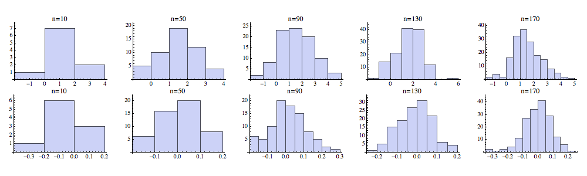
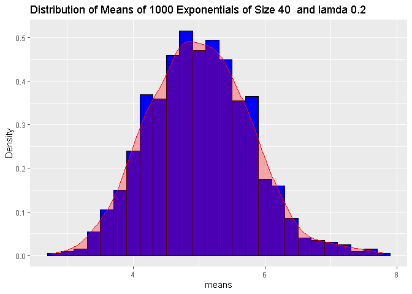

Central Limit Theorem - Exponencial distribution analysis:
================

## Introduction

In probability theory, the central limit theorem (CLT) establishes that,
in some situations, **when independent random variables are added**,
their **properly normalized sum tends toward a normal distribution**
(informally a bell curve) **even if the original variables themselves
are not normally distributed**. The theorem is a key concept in
probability theory because it **implies that probabilistic and
statistical methods** that work for normal distributions **can be
applicable to many problems** involving other types of distributions.(
[Wikipedia](https://en.wikipedia.org/wiki/Central_limit_theorem) ).

A theorical investigation of the **exponential distribution** was
performed in R and compared with the [Central Limit
Theorem](https://en.wikipedia.org/wiki/Central_limit_theorem). The
exponential distribution can be simulated in R with rexp(n, lambda)
where lambda is the rate parameter. The mean of exponential distribution
is 1/lambda and the standard deviation is also 1/lambda. lambda will be
set to 0.2 for all of the simulations.

An investigation of the **distribution of averages of 40 exponentials**
was performed with a **thousand simulations**.

The over all goal of this project is to show that **at large numbers the
distribution** of the collection of the **random exponentials** samples
tend to a **normal distribution**, proving the **Central limit
theorem**.

## Data:

The data here will be simulated:

The simulation will be carry out by R function: rexp(n,lambda)

where:

  - **mean** = 1/lambda = 5
  - **standard deviation** = 1/lambda ;
  - **lambda** = 0.2 ;

The distribution of 1000 averages of 40 exponentials simulations will be
analized.

  - **simulations** = 1000
  - **n** = 40

[See the data manipulation code here](https://github.com/CDopazo/Project_portfolio/blob/master/R/Statistical%20Inference/Exponencial_distribution/coding/data_simulation.R)

## Simulation Analisis

<!-- -->

[See the plot code here](https://github.com/CDopazo/Project_portfolio/blob/master/R/Statistical%20Inference/Exponencial_distribution/coding/Plot_1.R)

**There is almost no difference** between the **sample mean and the
theorical mean**, we spected that by doing so many simulations. The
difference between both is: 0.0023766. The same happend with the
variance, the difference between the theorical variance and the sampled
variance is 0.0265604

**sampled mean** = 5.0119113

**theorical mean** = 5

**sampled variance** = 0.6088292

**theorical variance** = 0.6

## Conclusion:

In fact, **the central limit theorem has been proved** with the
exponential function; **the distribution of averages** of 1000 random
**exponential functions** of length 40 has a **normal shape distribution
around 5** (the mean). The same happened with the theoretical and
empirical calculations of the mean and the standard deviation, which
were approximately equal, meaning that the **empirical matches
theoretical**.
