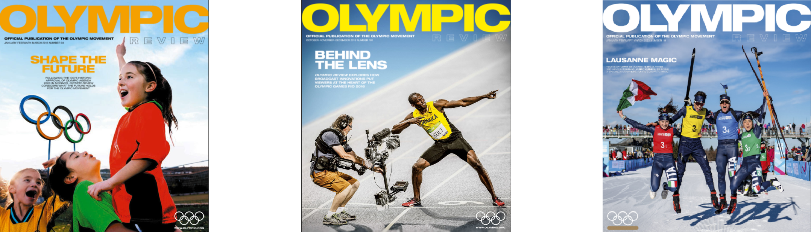

# Introduction

An analysis of the Olympics data from all the olympics games, **120 years of data including winter and summer seasons** was performed in order to highlight patterns or trends linked mainly with the **performance and health of the athletes and insights about the event organization and participation.**

This presentation insighs are proposals for the **Olympics Review magazine** which is the official magazine of the Olympic Movement. Published quarterly in English, French and Spanish, its content is a mix of official news and information as well as more in-depth features on topics of interest to the sporting movement.

[here](https://public.tableau.com/profile/carlos.dopazo.kozakas#!/vizhome/Olimpics_sport/OlympicsStory) you can find a Tableau presentation using the results of this analysis.

```{r echo=FALSE,message=FALSE, warning=FALSE,out.width="1000px"}
library(knitr)

```

Download the data [here](https://www.dropbox.com/sh/0wqw8fmiwrzr8ef/AABQijjQM522INXX1FCdamzma?dl=0)

```{r, echo=FALSE, message=FALSE, warning=FALSE, }
source("coding/data_manipulation.R")
```

The Data looks like this:
```{r, echo=FALSE, message=FALSE, warning=FALSE, }
head(olympics)
```

The data correspond to 120 years of olympics games, with **134.732 differents athletes** and **271.116 rows**.

Every row in the data correspond to record of some athlete playing in some olympic event, the columns are athlete's: **Name, Sex, Age, Height, Weight Team, NOC, Games, Year, Season, City, Sport, Event and Medal Awarded**.

In this Readme you will find the questions answered with **Hypothesis testing**.

But [here](XXXXXXXXXX) you can find some other questions answered with **Regressions Models** about this same data set:

## Questions to answer with Hypothesis testing:

* Athletes win more medals when games occur in their own country?.

* Athletes that plays more than one sport (generalist) have a better performance than the ones that keeps with the same sport(specialists)?


# Hypothesis testing


### Hypothesis 1:
#### Own country athletes win more models than foreing athletes?
* H0: Foreing atlhetes and Athletes from the same country hosting the games have the same probability to win a medal
* H1: Foreing atlhetes and athletes from the same country hosting the games have a different probability to win a medal.

#### Chi-squared test summary 1:
```{r, echo=FALSE, message=FALSE, warning=FALSE, }
test_1
```

#### Conclusion 1: 
**There is a significant statistical diference** (p-value: 2.2e-16) between the medals awarded to athletes in their own countries and athletes comepting in different countries, we can **reject the null hypothesis**, same country atlethes have a probability of ~ 23% to win any medal while different country athletes have ~ 14%. **A difference around 9%.**


### Hypothesis 2:
#### Athletes that historically plays more than one sport (generalist) have a greater or lower probability to win a medal than the ones that keeps with the same sport(specialists)?

* H0: Generalist and Specialist have the same probabilty of being awarded with any medal
* H1: Generalist and Specialist have different probabilty of being awarded with any medal

#### Chi-squared test summary 2:
```{r, echo=FALSE, message=FALSE, warning=FALSE, }
test_2
```
#### Conclusion 2: 
**There is a significant statistical diference** between the medals awarded to specialist and generalists, generalist in average tend to win more medals than specialists. **For every specialist are 0.14662 medals** and **for every generalist are 0.16307 medals**, maybe the differences is little, but its statistically significant p-value: `r test_2$p.value`. **A difference less 2%.**

