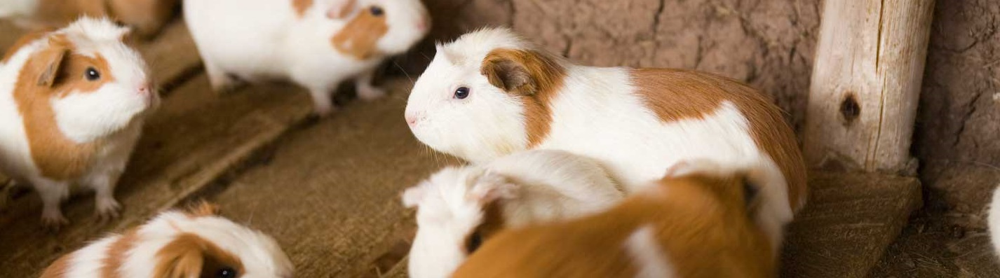
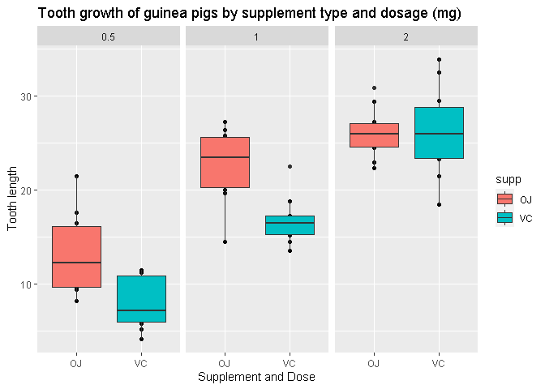

Tooth Grow Analysis:
================

## Introduction

The **“ToothGrowth”** data set contains the **length of odontoblasts
(cells responsible for tooth growth) in 60 guinea pigs**. Each animal
received one of three dose levels of vitamin C **(0.5, 1, and 2
mg/day)** by one of two delivery methods, **orange juice or ascorbic
acid** (a form of vitamin C and coded as VC).

The overall goal of this project is to **determine which
supplement(Orange Juice or Vitamine C) is better for tooth growing** in
the guineas pig.

**Download data here:**
[ToothGrowth\_data](https://forge.scilab.org/index.php/p/rdataset/source/tree/master/csv/datasets/ToothGrowth.csv)

**Information of the data set here:**
[ToothGrowth\_description](https://stat.ethz.ch/R-manual/R-devel/library/datasets/html/ToothGrowth.html)

**Reference:**:

Crampton, E. W. (1947). The growth of the odontoblast of the incisor
teeth as a criterion of vitamin C intake of the guinea pig. The Journal
of Nutrition, 33(5), 491–504. doi: 10.1093/jn/33.5.491.

**doi link here:** [doi](https://doi.org/10.1093/jn/33.5.491)

## Exploratory analysis:

The data looks like this

    ##    len supp dose
    ## 1  4.2   VC  0.5
    ## 2 11.5   VC  0.5
    ## 3  7.3   VC  0.5
    ## 4  5.8   VC  0.5
    ## 5  6.4   VC  0.5
    ## 6 10.0   VC  0.5

Here is some overall information of the data set:

    ## 'data.frame':    60 obs. of  3 variables:
    ##  $ len : num  4.2 11.5 7.3 5.8 6.4 10 11.2 11.2 5.2 7 ...
    ##  $ supp: Factor w/ 2 levels "OJ","VC": 2 2 2 2 2 2 2 2 2 2 ...
    ##  $ dose: num  0.5 0.5 0.5 0.5 0.5 0.5 0.5 0.5 0.5 0.5 ...

    ##       len        supp         dose      
    ##  Min.   : 4.20   OJ:30   Min.   :0.500  
    ##  1st Qu.:13.07   VC:30   1st Qu.:0.500  
    ##  Median :19.25           Median :1.000  
    ##  Mean   :18.81           Mean   :1.167  
    ##  3rd Qu.:25.27           3rd Qu.:2.000  
    ##  Max.   :33.90           Max.   :2.000

The dataset contains 60 observations of tooth growing for 60 Guinea Pigs
subjects on 3 variables:

**len:** length of odontoblasts (cells responsible for tooth growth)

**supp:** supplement type/delivery method (orange juice:OC or ascorbic
acid:VC)

**dose:** Vitamin C dose in millingrams (mg)

## Preliminary box-plot

<!-- -->

[See the plot code here](XXXXXXXX)

In this preliminary chart it **seems like the Orange Juice (OJ) is a
better supplement for Toothgrowing than Ascorbic Acid(VC)**, and also it
seems like **a higher dosage leads to a higher growth of the tooth**
regardless the type of supplement but first we are going to do some
hipothesis testing to prove these statements.

## Hypothesis testing to find which is the better supplement:

A tests to compare tooth growth of the subjects by supplement (OJ, VC)
and dose (0.5, 1.0, and 2.0 mg) will be performed.

### The Hypotheses are:

**H0:** For a **given dose level** of Vitamin C, **there is no
difference** in average tooth growth between the supplements ( OJ:
Orange Juice or AA: Ascorbic Acid).

**Ha:** For a **given dose level** of Vitamin C, **there is a
difference** in average tooth growth between the supplements ( OJ:
Orange Juice or AA: Ascorbic Acid).

## Results of the supplement Hypothesis Testing:

#### Example of the overall **t.test output** for the supplements for the **0.5 dosage**:

    ## 
    ##  Welch Two Sample t-test
    ## 
    ## data:  len by supp
    ## t = 3.1697, df = 14.969, p-value = 0.006359
    ## alternative hypothesis: true difference in means is not equal to 0
    ## 95 percent confidence interval:
    ##  1.719057 8.780943
    ## sample estimates:
    ## mean in group OJ mean in group VC 
    ##            13.23             7.98

  - **For all dosage together**:

The null hypothesis H0 with alpha= 0.05 **CAN’T BE REJECTED**

The p-value of **0.0606345** suggest there is insufficient evidence to
show that there is a difference in tooth growth when using supplement
Orange Juice and Ascorbic Acid at any dosage.

  - **For the 0.5 mg dosage:**

The null hypothesis H0 with alpha= 0.05 is **REJECTED**

The p-value of **0.0063586** suggest with a high probability that Orange
Juice and Ascorbic Acid are not equally strong promoting the average
tooth growth when the dosage is 0.5 mg.

  - **For the 1.0 mg dosage:**

THE null hypothesis H0 with alpha= 0.05 is **REJECTED**

The p-value of **0.0010384** suggest with a high probability that Orange
Juice and Ascorbic Acid are not equally strong promoting the average
tooth growth when the dosage is 0.5 mg.

  - **For the 2.0 mg dosage:**

The null hypothesis H0 with alpha= 0.05 **CAN’T BE REJECTED**

The p-value of **0.9638516** suggest there is insufficient evidence to
show that there is a difference in tooth growth when using supplement
Orange Juice and Ascorbic Acid at dosage 2.0 mg.

## Hypothesis testing to find if a higher dose leads to a highter tooth grow regardless the supplement.

### The Hypotheses are:

**H0:** For a **given supplement** of Vitamin C, **there is no
difference** in average tooth growth between the dosage levels (0.5mg,
1.0 mg and 2.0 mg of OJ: Orange Juice or AA: Ascorbic Acid).

**Ha:** For a **given supplement** of Vitamin C, **there is a
difference** in average tooth growth between the dosage levels (0.5mg,
1.0 mg and 2.0 mg of OJ: Orange Juice or AA: Ascorbic Acid).

## Results of the dosage Hypothesis Testing:

#### For all supplements:

  - **Low dosage (0.5mg vs 1.0mg) for all supplementes (OJ and VC):**

The null hypothesis H0 with alpha= 0.05 is **REJECTED**

The p-value of **1.2683007^{-7}** suggest with a high probability that
0.5mg and 1.0mg dosage are not equally strong promoting the average
tooth growth regardless the type of supplement.

  - **High dosage (1.0mg vs 2.0mg) for all supplementes (OJ and VC):**

The null hypothesis H0 with alpha= 0.05 is **REJECTED**

The p-value of **1.2683007^{-7}** suggest with a high probability that
1.0mg and 2.0mg dosage are not equally strong promoting the average
tooth growth regardless the type of supplement.

#### For the Orange Juice (OJ):

  - **Low dosage (0.5mg vs 1.0mg) for OJ:**

The null hypothesis H0 with alpha= 0.05 is **REJECTED**

The p-value of **8.7849191^{-5}** suggest with a high probability that
0.5mg and 1.0mg dosage are not equally strong promoting the average
tooth growth when the supplement is Oranje Juice.

  - **High dosage (1.0mg vs 2.0mg) for OJ:**

The null hypothesis H0 with alpha= 0.05 is **REJECTED**

The p-value of **0.0391951** suggest with a high probability that 1.0mg
and 2.0mg dosage are not equally strong promoting the average tooth
growth when the supplement is Oranje Juice.

#### For the Ascorbic Acid (VC):

  - **Low dosage (0.5mg vs 1.0mg) for VC:**

The null hypothesis H0 with alpha= 0.05 is **REJECTED**

The p-value of **6.8110177^{-7}** suggest with a high probability that
0.5mg and 1.0mg dosage are not equally strong promoting the average
tooth growth when the supplement is Ascorbic Acid.

  - **High dosage (1.0mg vs 2.0mg) for VC:**

The null hypothesis H0 with alpha= 0.05 is **REJECTED**

The p-value of **9.1556031^{-5}** suggest with a high probability that
1.0mg and 2.0mg dosage are not equally strong promoting the average
tooth growth when the supplement is Ascorbic Acid.

[See the code for the inference here](XXXXXXX)

## Conclusions:

After executing all the hypothesis analysis, we can conclude that for
this data of tooth growing in Guineas pigs that:

1.  **At lower dosage (0.5mg and 1.0mg) the Orange Juice seems to be
    more effective than Vitamin C for tooth growing**. On the other hand
    **at a higher dosage (2.0 mg), there is a high probability that
    these supplements are equally effective for tooth growing.**

2.  The **dosage seems to affect the growing of the tooth** in the
    Guineas pigs **regardless the type of supplements**.

All of these conclusions are assuming:

1.  **Not paired observations:** because the data states that were 60
    diferents guinea-pigs subjects

2.  **Different variances:** The dataset provides no information on this
    subject, so the safer choice is to asume different variances.
